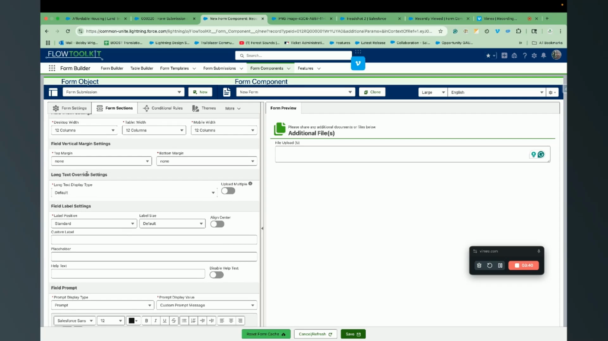
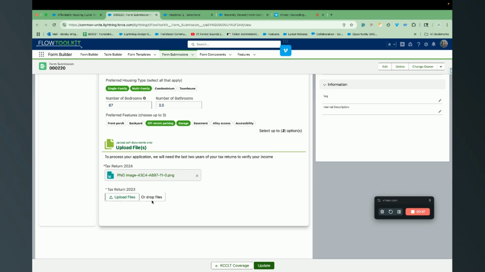

# How To: Set Up File Uploads

> Add file upload fields to your forms and handle uploaded files in your Flow.


**Prerequisites**: A form created in Form Builder. See [Build a Form](build-a-form.md).


## Video Walkthroughs





## Overview

Flow Tool Kit supports file upload fields on forms — users can attach documents, images, or other files as part of their form submission. Uploaded files are stored as Salesforce ContentDocument records linked to the parent record.

## Step 1: Add a File Upload Field

1. Open your form in **Form Builder**.
2. Add a **File Upload** component to a section.
3. Configure the field properties:

| Property | Description | Example |
|----------|-------------|---------|
| **Label** | Field label shown to users | "Upload Resume" |
| **Required** | Whether a file must be uploaded | `true` or `false` |
| **Accepted Formats** | Comma-separated list of file extensions | `.pdf,.doc,.docx,.png,.jpg` |
| **Max File Size** | Maximum file size in bytes | `5242880` (5 MB) |
| **Multiple** | Allow multiple files | `true` or `false` |

4. Save the form.

## Step 2: Use in a Flow

When the user uploads a file through the form:

1. The file is stored as a **ContentDocument** in Salesforce.
2. A **ContentDocumentLink** connects it to the specified parent record.
3. The file information is available in the Flow Form's output.

## Step 3: Handle Files in Flow Logic

After the form screen, you can:

- **Link files to a record** — if you're creating a new record, the files are linked after the record is created
- **Process uploaded files** — use the **File Upload Serialize/Deserialize** invocable actions to work with file data in your Flow logic
- **Package files** — use the **Content Document to Zip** action to bundle multiple uploads

## File Upload Invocable Actions

| Action | Description |
|--------|-------------|
| [File Upload Serialize](../invocable-actions/file-upload-actions.md) | Serialize file upload data for storage or transport |
| [File Upload Deserialize](../invocable-actions/file-upload-actions.md) | Deserialize stored file data back into ContentDocument records |
| [Content to Zip](../invocable-actions/file-upload-actions.md) | Package multiple ContentDocuments into a single zip file |

## Tips


**File size limits**: Salesforce enforces file size limits based on your org edition. The form-level max file size setting should be equal to or less than your org's limit.


- **Accepted formats** — be specific. Instead of accepting all file types, list only what you need (e.g., `.pdf,.png,.jpg` for an application form)
- **Multiple files** — if users need to upload several documents, enable the multiple option rather than adding multiple upload fields
- **Guest users** — file uploads on Experience Cloud require additional guest user permissions for ContentDocument and ContentVersion objects

## Related Pages

- [File Upload Actions Reference](../invocable-actions/file-upload-actions.md) — invocable actions for file processing
- [Build a Form](build-a-form.md) — creating forms
- [Form Components Reference](../form-configuration/form-components-system.md) — all field types
