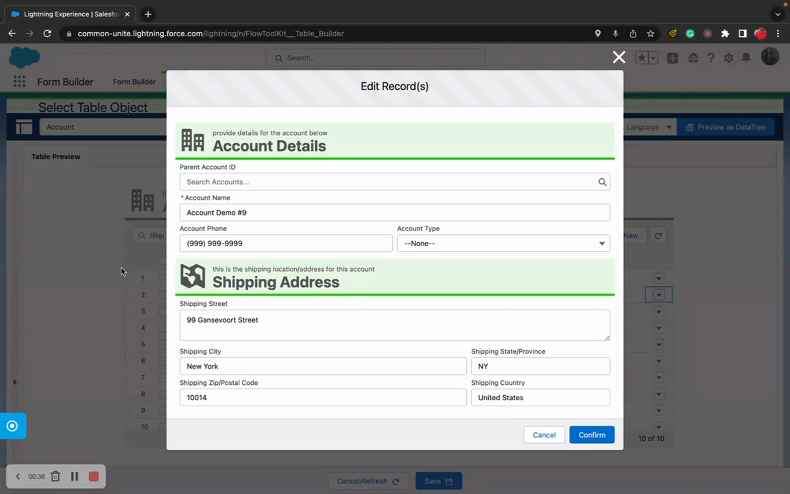

# How To: Use Data Tables

> Display, edit, and manage record collections in a table format on Flow Screens.


**Prerequisites**: Flow Tool Kit installed and permission sets assigned. See [Installation](../getting-started/installation.md).


## Video Walkthrough



## Overview

The Data Table component lets users view and manage multiple records at once — think line items on an order, contacts on an account, or tasks in a project. It supports:

- Inline editing
- Row creation, deletion, and cloning
- Bulk selection
- Search and filter
- Pagination and sorting
- Custom row actions

## Step 1: Create a Table Form in Form Builder

1. Open **Form Builder** and create a new Form for the object you want to display (e.g., Opportunity Line Item).
2. Add the fields you want as **columns** — Product Name, Quantity, Unit Price, Total Price, etc.
3. Save the form.


**Tip**: Table columns are defined by the fields on the form. The field order in Form Builder determines the column order in the table.


## Step 2: Add Data Table to a Flow Screen

1. In Flow Builder, add a **Screen** element.
2. Find **Data Table** in the component panel (under FlowToolKit).
3. Drag it onto the screen.
4. Configure the component:

| Property | Value | Description |
|----------|-------|-------------|
| **Object** | e.g., `OpportunityLineItem` | The object to display |
| **Form** | Your table form | Defines the columns |
| **Prefill Records** | Record collection variable | Existing records to display |
| **Allow New** | `true` or `false` | Can users add rows? |
| **Allow Edit** | `true` or `false` | Can users edit cells? |
| **Allow Delete** | `true` or `false` | Can users remove rows? |

## Step 3: Handle Table Output in Your Flow

After the screen, the Data Table provides three output collections:

| Output | Description | DML |
|--------|-------------|-----|
| `insertCollection` | New records the user added | Create Records |
| `updateCollection` | Existing records the user modified | Update Records |
| `deleteCollection` | Records the user marked for deletion | Delete Records |

Add the appropriate DML elements after the screen to process each collection.

## Step 4: Test

1. Debug the Flow with sample data in the `prefillRecords` collection.
2. Test adding, editing, and deleting rows.
3. Verify the DML elements process correctly after the screen.

## Advanced Features

### Inline Editing

Enabled by default when `allowEdit` is true. Users click a cell to edit it. Validation rules from the form apply.

### Row Actions

Add custom buttons/actions to each row (e.g., "View Details", "Clone", "Calculate"):
- Configure row actions in the Data Table properties
- Actions fire events that your Flow can handle

### Pagination

For large datasets:
- Set a **page size** to control how many records display per page
- Users navigate between pages with built-in controls

### Record Template

Provide a **record template** with default values for new rows:
- Create a record variable with your default values
- Assign it to the `recordTemplate` property
- When users add a new row, it starts with those defaults

### Min/Max Rows

Control how many records are required:
- **Min**: Minimum rows required to proceed (validation)
- **Max**: Maximum rows allowed in the table

## Common Patterns

### Order Line Items
- Object: `OpportunityLineItem`
- Columns: Product, Quantity, Unit Price, Total Price
- Allow New + Edit + Delete, use Record Template for default quantity = 1

### Related Contacts List
- Object: `Contact`
- Prefill: Contacts related to the parent Account
- Columns: Name, Email, Phone, Title
- Read-only display (no editing)

### Task Checklist
- Object: `Task`
- Columns: Subject, Status, Priority, Due Date
- Allow Edit (inline status update), no new/delete

## Related Pages

- [Data Table Reference](../screen-components/data-table.md) — all properties and configuration
- [Build a Form](build-a-form.md) — create the form that defines table columns
- [Configure Lookup Fields](configure-lookup-fields.md) — lookup fields in table cells
