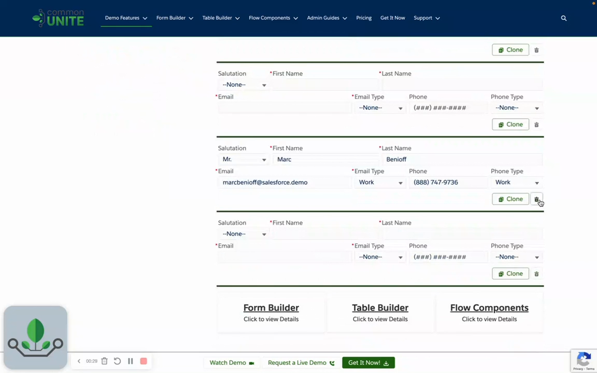

# How To: Use Repeating Sections

> Add table repeater sections for line items, attendees, or any repeating data entry.


**Prerequisites**: A form created in Form Builder. See [Build a Form](build-a-form.md).


## Video Walkthroughs





## Overview

Repeating sections (table repeaters) let users add multiple rows of data within a form — think line items on an order, attendees at an event, or multiple addresses. Instead of pre-defining a fixed number of fields, users add rows as needed.

## Step 1: Add a Repeating Section to Your Form

1. Open your form in **Form Builder**.
2. Add a section and configure it as a **Repeating Section** (table repeater type).
3. Add the fields that make up each row — these become the columns.

For example, for order line items:
- Product Name (lookup)
- Quantity (number)
- Unit Price (currency)
- Notes (text)

## Step 2: Configure Repeater Options

| Option | Description |
|--------|-------------|
| **Min Rows** | Minimum number of rows required |
| **Max Rows** | Maximum number of rows allowed |
| **Allow Add** | Users can add new rows |
| **Allow Delete** | Users can remove rows |
| **Default Rows** | Number of rows displayed initially |

## Step 3: Use the Output

The repeating section outputs a **collection** of records. After the form screen in your Flow:

1. Reference the output collection from the Flow Form component.
2. Use a **Loop** element or **Create Records** element to process each row.

## Tips

- **Keep rows simple** — 3-5 columns per row works best. Too many columns make the repeater hard to use on smaller screens.
- **Set reasonable limits** — use Min/Max to prevent empty submissions and unreasonable row counts.
- **Default rows** — start with 1 row pre-populated so users understand the format.
- **Validation** — required fields within the repeater apply to each row individually.

## Common Patterns

| Use Case | Row Fields |
|----------|-----------|
| Order line items | Product, Quantity, Price |
| Event attendees | Name, Email, Dietary Needs |
| Expense report | Date, Category, Amount, Description |
| Contact list | First Name, Last Name, Email, Phone |

## Related Pages

- [Data Table](../screen-components/data-table.md) — alternative for managing record collections
- [Form Components](../form-configuration/form-components-system.md) — all field types
- [Build a Form](build-a-form.md) — form creation basics
