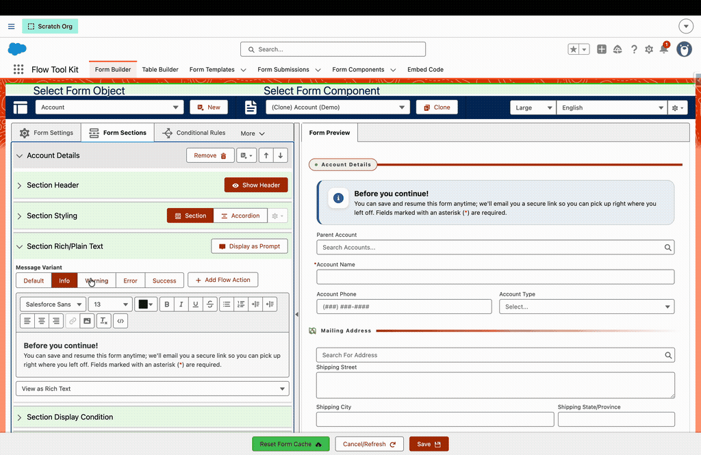
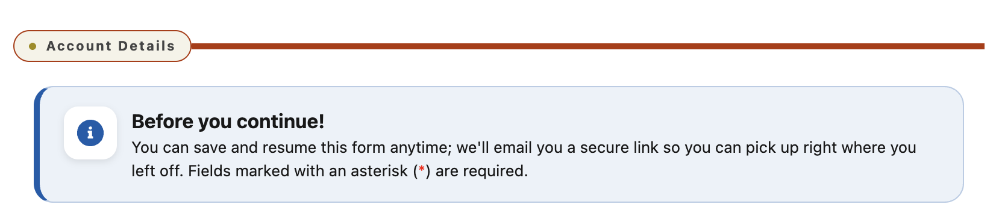

# Use Rich Text Message Cards

> Turn any Rich Text section into a themed status card — info, warning, error, or success — with a colored left edge, a tinted fill, and a status icon.


**Prerequisites**: A form built in the **Form Builder** with a **Rich Text** section.


## What It's For

A Rich Text section normally renders as plain text. With a **Message Variant**, the same section becomes a designed **message card** — useful for validation summaries, callouts, tips, or confirmations. The card's color, left accent edge, and icon are driven entirely by Lightning Design System status tokens, so it matches your org's branding across internal Lightning and Experience Cloud (LWR and Aura) sites.

## The Variants

| Variant     | Renders as                     |
| ----------- | ------------------------------ |
| **Default** | Plain rich text (no card)      |
| **Info**    | Blue card with an info icon    |
| **Warning** | Amber card with a warning icon |
| **Error**   | Red card with an error icon    |
| **Success** | Green card with a success icon |

## Step 1: Add a Rich Text Section

In the Form Builder, use the **Insert New Section** menu (＋) on any section and choose **Rich Text** under _Formatting_.

## Step 2: Pick a Message Variant

Expand the **Section Rich/Plain Text** panel and choose a **Message Variant**. Leave it on **Default** to keep the content as plain rich text.

## Step 3: Write the Message

Use the rich text editor to write your message. A bold first line reads as the card's heading, followed by the body. The text supports rich formatting and resolves merge fields (e.g. `{!Account.Name}`), just like a header.

**Example (Info):**

> **Before you continue** You can save and resume this form anytime — we'll email you a secure link to pick up right where you left off. Fields marked with an asterisk (\*) are required.

## Theming

The card takes its accent color from your org's SLDS status tokens — no per-card color settings. Each variant maps to a standard status color (info/warning/error/success), and when a token isn't present in a given runtime it falls back through the Experience Cloud (`--dxp-*`) and Lightning (`--lwc-*`) tokens to a sensible default — so the card looks right everywhere it renders.


Because the colors are token-driven, the card automatically matches a branded Experience Cloud site's status palette.

