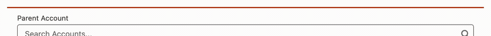
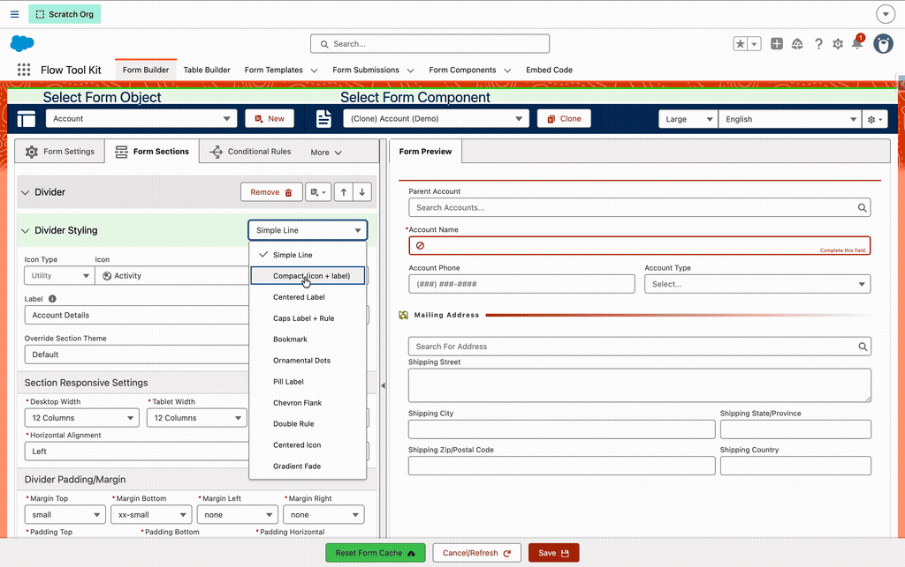

# How To: Use Section Dividers

> Turn a plain divider into one of 12 designed styles — a labeled rule, a brand bookmark, a centered icon, and more — all themed from your Form Theme.


**Prerequisites**: A form built in the **Form Builder** with at least one **Divider** section. Colors come from the form's **Form Theme**, so assign a theme to see your brand applied.


## What It's For

A **Divider** section breaks a form into visual segments. Instead of only a plain line, you can pick a **Divider Style** that adds a label, an icon, or a decorative treatment — useful for section headings, step separators, or simply a more polished form. Every style is drawn with Lightning Design System building blocks and colored entirely from your Form Theme, so dividers match the rest of your form automatically.

## The Styles

| Style | Looks like |
|-------|-----------|
| **Simple Line** | A clean horizontal rule (the default) |
| **Compact** | Leading icon + label, then a rule that fades out; optional subtitle |
| **Centered Label** | Label centered between two rules |
| **Caps Label + Rule** | Label on the left, rule filling the rest |
| **Bookmark** | A brand-filled tag with an arrow notch, flowing into a rule |
| **Ornamental Dots** | Three centered dots with a label beneath |
| **Pill Label** | A rounded brand pill sitting on a rule |
| **Chevron Flank** | Rules and chevrons flanking a centered label |
| **Double Rule** | Label on the left, two stacked hairlines |
| **Centered Icon** | A circular icon chip between two rules |
| **Gradient Fade** | A small label above a rule that fades away |
| **Tag** | A rounded brand-tint tag with a dot + label, into a rule |

## Step 1: Add a Divider Section

In the Form Builder, use the **Insert New Section** menu (＋) on any section and choose **Divider** under *Formatting*.

## Step 2: Pick a Style

Open the divider section's **Divider Style** panel and choose a style from the **Style** dropdown. *Simple Line* is the default.

## Step 3: Add a Label (and Subtitle / Icon)

- **Label** — type the text shown by the style. The label supports **rich text**, so you can add your own styling tags. Text is shown exactly as you type it — if you want it uppercase, type it uppercase.
- **Icon** — for the **Compact** and **Centered Icon** styles, an **Icon** picker appears. Choose any SLDS icon (e.g. `utility:flag`). If you leave it blank, no icon is shown.
- **Subtitle** — the **Compact** style also shows the section's subtitle beneath the label.


The label, subtitle, and icon reuse the divider section's existing **Title**, **Subtitle**, and **Icon** fields — so merge fields like `{!Account.Name}` resolve in a divider label just as they do in a header.


## Theming

Dividers take **all** of their color and thickness from the assigned Form Theme — there are no per-divider color settings:

| Theme field | Controls |
|-------------|----------|
| **Border Color** | Rule/line color |
| **Border Size** | Rule/line thickness (including the Simple Line) |
| **Brand Color** | Pill, bookmark, and tag fills; dots |
| **Heading Font Color** | Label text |
| **Heading Icon Color** | Icon and chevron color |
| **Heading Subtitle Font Color** | Subtitle text |

If a theme leaves one of these blank, the divider falls back to your site's branding automatically — Experience Cloud (LWR and Aura) and internal Lightning brand colors — before any hardcoded default.


Because color and size are theme-driven, changing your Form Theme restyles every divider on the form at once.

