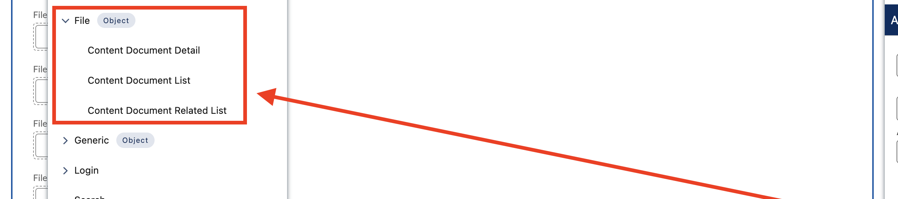

# Flow Tool Kit v3.218 Release Notes

## New Feature

### Iframe Embed Mode — Embed Forms on External Websites (#100)

Embed Flow Tool Kit forms on any website using a simple iframe snippet. Visitors fill out forms directly on your website without seeing the Salesforce UI or needing a Salesforce account.

**Three embed types:**
- **Flow** — embed any screen flow with optional input parameters (pv1-pv9, recordId, submissionId)
- **Form Template** — embed a multi-page Form Template with confirmation pages
- **Record Form** — embed a record creation form with object and form component selection

**How it works:**
1. Create a Force.com Site (Classic or Aura Experience Cloud)
2. Set clickjack protection to "No protection" on the Site detail page
3. Assign the **Form Flow User** permission set to the site's guest user
4. Open the **Embed Code** tab, select your site and form, and copy the generated iframe snippet
5. Paste the snippet into your external website's HTML

**Key details:**
- Auto-resize — the iframe height adjusts automatically as the form content changes
- Completion messaging — the parent page receives a `postMessage` event when the form is submitted
- Works on both Classic (Visualforce) and Aura Experience Cloud sites
- LWR sites are not supported (filtered from the site selector)
- No authentication required — forms are served via the site's guest user

**Documentation:** [Iframe Embed Guide](../advanced-topics/iframe-embed.md)

**New components:**
- `EmbedForm` — Visualforce page that bootstraps Lightning Out and renders the selected component
- `Embed Code Generator` — admin UI tab for configuring and generating embed snippets
- `EmbedCodeGenerator_Controller` — Apex controller for querying sites, flows, and templates
- `iframeUtils` — shared utility module for iframe detection, resize, and completion messaging

## Bug Fixes

### `@salesforce/user/isGuest` Returns False in Lightning Out (#99)

`@salesforce/user/isGuest` returns `false` when components run via Lightning Out on a Force.com Site, even though the user is a guest. This caused confirmation pages not to display after form submission, and allowed duplicate submissions.

**Fixed by** adding `IS_IN_IFRAME` as a secondary check alongside `isGuest` in all affected components:
- `formTemplate` — confirmation page display, update guard, NOT_FOUND error handling
- `lightningRecordForm` — confirmation display, button hiding, update guard, NOT_FOUND handling
- `lightningRecordFieldEdit` — button hiding, update guard
- `formFieldFileUpload` — guest upload token, recordId handling
- `flowForm` — IsGuest conditional logic, guest language dispatch, admin feature guard

### Address Section Missing Rounded Edges (#98)

Address sections with box or shadow styling did not apply rounded corners (`topRadius`/`bottomRadius` classes). The `themeClass` getter in `formSectionTheme` checked the mutated `cls` variable instead of the original `this.sectionClass`, so the strict equality check always failed for address sections.

### reCAPTCHA Threshold Comparison

The reCAPTCHA score validation used strict less-than (`<`) instead of less-than-or-equal (`<=`). A score of exactly 0.5 with a threshold of 0.5 would incorrectly fail. Changed to `<=` so matching scores pass.

## Configuration Note

### File Upload Preview in Experience Cloud (#89)

If file preview links redirect to the home page in Experience Cloud, add the **File (Object)** pages to your site in Experience Builder (Pages > File). This enables `/{ContentDocumentId}` navigation to resolve to the file record page with inline preview.

