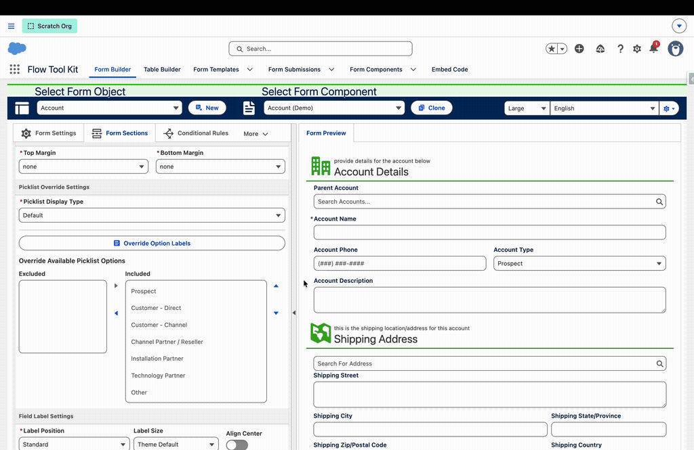
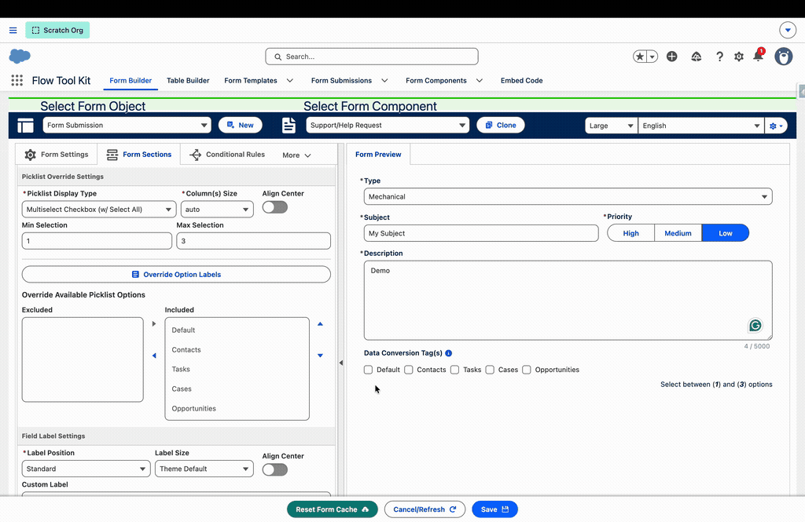
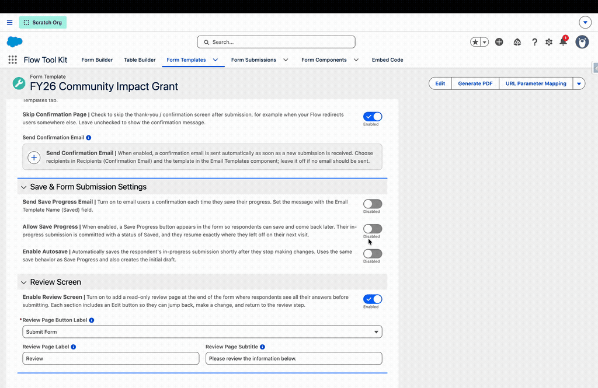
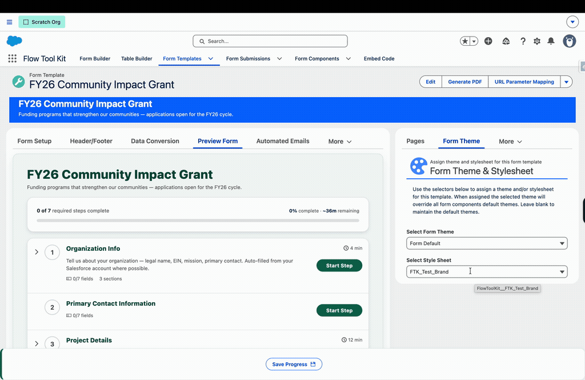

# Release 3.239

> ## 🚨 CRITICAL FIX: Adding form components to new flows failed to save (#245)
>
> **If your admins add any Flow Tool Kit screen component to a newly created flow, upgrade to 3.239 immediately.** Salesforce changed how Flow Builder passes element information to component property editors on newer flow API versions (new flows now default there). The change corrupted the automatically assigned Record input into an invalid `[object Object].record` reference, and the flow failed to save with _"The type for the input parameter 'Record' doesn't match the type for the assigned value."_
>
> **This affects every released Flow Tool Kit version** when a component is newly added to a new flow; existing configured screens keep working. 3.239 fixes all eleven screen-component property editors in one pass, handling both the old and new platform formats, so it is safe regardless of your Salesforce release. If a flow was already corrupted, remove and re-add the component or point its Record input at the screen component's own `record` output.

Beyond the critical fix, three headline additions this release: **Form Template autosave**, **custom picklist option labels** with live merge-field support, and **per-template style sheets**. Alongside them: stage-driven vertical indicators with click navigation in both runtimes, Stage Mode layout options, a template-level final submit button label, a major upgrade to the Log Conversion Event flow action, new numbering merge fields, accessibility improvements for screen readers, and a batch of Form Builder fixes.

> **Upgrades cleanly from 3.238**: no managed-package members were removed.

## New

### Custom Picklist Option Labels (#223)

Your picklist values are named for your database; your respondents should never have to read them. Any picklist or multiselect field can now display **per-form custom option labels** while the stored values keep their API names, so reports, record-triggered flows, and integrations are completely unaffected. The same Status field can read as formal wording on a client-facing application and as internal shorthand on a staff form, with no metadata changes and no value renames.

Select a picklist field in Form Builder and click **Override Option Labels** in Picklist Override Settings. The editor lists every value beside a Custom Label input (the default label is the placeholder); override any subset and leave the rest empty to keep their defaults. The button shows a count so overridden fields are easy to spot.

The headline trick: custom labels run through the standard merge pipeline, so an option's wording can **react to the respondent's other answers in real time**. Label an option `Tasks ({{FlowToolKit__Priority__c}})` and it re-renders as "Tasks (Medium)" the instant the respondent picks Medium:

Overrides apply across every picklist display type (dropdown, radio, buttons, icon rating, path, multiselect checkbox, dual listbox), and merge fields elsewhere on the form that render the field's value display the custom label too, keeping the experience consistent through confirmation messages and review screens. Full guide: [Picklist Option Labels](../form-configuration/picklist-option-labels.md).

### Form Template Autosave (#216)

Form Templates can now save the respondent's in-progress submission **automatically and silently** as they work, with no Save Progress click required. Autosave uses the same save pipeline as Save Progress (the draft is a normal Form Submission with status "Draft"), creates the initial draft on its own if the respondent never clicks anything, and keeps the current page's stage record in sync in Stages Mode.

Enable it per template under **Save & Form Submission Settings → Enable Autosave**, then pick an **Autosave Mode**:

* **Upon Change** (default) is a debounce: every change restarts a 3-second countdown, so the save lands 3 seconds after the respondent _stops_ making changes and never interrupts active typing. A 15-second max-wait cap guarantees that continuous typing (which keeps resetting the countdown) still checkpoints at least every 15 seconds from the first unsaved change.
* **Every 10 Seconds / Every 30 Seconds** run a checkpoint clock that starts on the respondent's **first change** (not page load) and skips any tick where nothing changed. Nothing is ever written when nothing changed.

In every mode, autosave is **100% interaction-driven**: someone who only reads the form never triggers a save, and any save (automatic or manual) disarms the timers until the next change re-arms them. A manual Save Progress click cancels pending countdowns, an autosave that comes due mid-save waits and retries instead of double-saving, and autosave failures log quietly to the console rather than toasting the respondent every cycle. Autosave stays out of the way inside Flow screens (where your Flow owns the DML), on read-only forms, and on already-submitted submissions. Guest and embedded (iframe) contexts are fully supported through the same upsert flow as Save Progress.

See the full write-up in [Save and Resume Forms](../form-template-framework/how-to/save-and-resume-forms.md#autosave).

### Per-Template Style Sheets (#221)

Each Form Template can now carry its own CSS style sheet. A new **Style Sheet** selector on the Form Template record page lists the org's style-sheet static resources, grouped by namespace with descriptions pulled from the static resource, and the chosen sheet is injected scoped to just that template's rendered output. Combined with the automatic template-Id wrapper class, this makes per-template branding possible without touching any other form on the page.

The styling documentation was reorganized around a new [Custom Styling Overview](../form-configuration/custom-styling-overview.md) hub that walks the basic-vs-advanced paths.

### Question & Section Numbering Merge Fields (#72)

Two new merge shorthands number your form automatically: `{{fieldnumber}}` and `{{sectionnumber}}` can be used in field labels, help text, prompts, and placeholders (for example, a label of `Question {{fieldnumber}}`). Numbering counts **visible** fields only and renumbers live: hide a field with conditional logic and every later number shifts up with no gaps. Sections skip dividers and illustrations. Each form component instance numbers from 1, so template sections and repeated forms restart naturally.

### Form Templates on Any Record Page (#234)

The Form (Template) component is now practical on any Lightning record page, not just Form Template and Form Submission pages. Two new builder properties do the work:

* **Related Field Name** is now a dynamic picklist listing every Form Template / Form Submission lookup reachable from the page's object: its own fields, each parent's, and each grandparent's (for example `CampaignMember > Campaign > Form Template`). Options group by object with Form Template references listed before Form Submission references.
* **Form Template (Fallback)** lists all Form Templates and loads when nothing else resolves. On App and Home pages it can also load a template directly with no record context at all.

Resolution order for a record that is not itself a template or submission: the Related Field Name lookup, then the Form Template Source custom metadata mapping, then the fallback template. Submissions created through the source mapping or the fallback are stamped with the hosting record's id in `Source_Id__c`, so they report and resume from that record. When nothing resolves, the component now shows a compact "No Form Found" illustration with configuration guidance.

### Log Conversion Event Action Upgrades (#237, #238)

The **Form Template | Log Conversion Event** flow action is now flexible enough to be the single logging tool for any conversion process, packaged or custom:

* **Log-only mode**: the custom status field, lookup field, and platform event inputs are all optional now. A Success event with none of them selected simply creates a Conversion Log record without touching the Form Submission. Error events always update the standard Conversion Status and Conversion Log fields, so failures are never silent.
* **Dispatch Return Event**: a new toggle, shown for Success events, publishes a Form Submission Convert platform event after the success is logged. The event returns control to the conversion controller flow named on the submission's Form Template, so an external process (a custom approval or budgeting flow, for example) can log its result and hand the pipeline the next step in one action.
* **The packaged conversion flows now use it everywhere (#238)**: all fifteen Form Submission Convert flows call this action directly instead of the Form_Submission_Convert_Log_Event subflow, across 53 call sites. Each flow carries fewer elements, logging behavior is identical across every object step, and custom overridable flows can follow the same pattern.

The action processes up to 200 requests per invocation with bulk-safe queries and DML, so it is safe to call from record-triggered flows.

### Stage-Driven Vertical Indicators (#242, #142)

The vertical stage indicator is now a live progress map and a navigation surface in **both** runtimes, driven by the Form Submission Stage records:

* **Marker language**: a green filled check marks completed pages, a blue filled pencil marks the page the respondent is on, a clock marks pages in progress, an orange warning marks pages needing correction, a lock marks locked stages, and a gray dot marks pages not yet visited. Connector lines stay neutral.
* **Stages Mode navigation**: every page is clickable from inside a stage except the current page and locked stages; clicking saves the page being left and opens the target, exactly like returning to the overview and starting the step.
* **Linear templates now track progress too**: entering a page marks it In Progress and a validated Next marks it Done, so completed pages stay green across back-navigation (previously, going back and saving reverted completion). Leaving a completed page in an invalid state, for example after clearing a required field, flips it to the warning marker until it is fixed. Respondents can always click backward, and can click **forward to any page they have already visited**, so returning to page one no longer strands them from their last in-progress page. Progress persists whenever the submission saves (autosave, Save Progress, submit), with no new record creation for forms that never save.
* **Accessibility**: the indicator reports real percent complete to assistive technology, and clickable steps are keyboard-operable with Enter or Space.

> **Visual change**: linear templates using the vertical indicator switch from the brand-blue ring style to the marker set above. Standalone Form (Stage Indicator) flow screen components are unchanged.

### Stage Mode Layout Options (#243)

A new **Stage Mode Layout** multiselect on the Form Template tunes the Stages Mode overview per template:

* **Hide Progress Banner** removes the progress summary card (step counts, percent complete, progress bar).
* **Hide Completed Fields** removes the per-stage field and section count pills; validation error counts still show.
* **Display Template Header** renders the template's configured Header form component in place of the plain title and subtitle, in the same rounded card treatment as the linear layout, so a branded banner carries into the stages overview.

Configure it under Template Settings; the options appear when Stages Mode is enabled.

### Final Submit Button Label (#244)

The form's true final submit button is now labeled from the **Form Template** instead of borrowing the last page's Button Label, which conditional page rules could make unpredictable. Two template-level picklists split the job:

* **Submit Button Label** (new) labels the submit wherever it actually submits: the review page's submit button, the Stages Mode overview button when no review screen is enabled, and the last visible page's forward button in the linear runtime.
* **Review Page Button Label** (repurposed) now labels the button that **opens** the review page, with a new "Continue to Review" default; the button that finishes the form on the review page itself reads the Submit Button Label.

Blank fields fall back to the previous page-sourced labels, so nothing changes until you opt in.

> **Upgrade note**: on templates with the review screen enabled, an existing Review Page Button Label value now labels the open-review button. Set the new Submit Button Label after upgrading so the review page's submit reads the wording you want.

## Improvements

* **Every packaged flow is now self-documenting (#240)**: all 40 flows carry admin-facing descriptions, and more than 500 individual elements (decisions, platform event publishes, subflow calls, input and output variables, formulas) explain their design in place: what launches each flow, the contract an override must keep, and the reasoning behind non-obvious behavior such as the conversion controller's one-event-per-pass state machine, error halting with Reprocess recovery, and duplicate-rule bypass during unattended conversion. Open any element in Flow Builder to read its role. All flows also moved to API version 67.0.
* **Flow Tool Kit icon on every action (#239)**: all 28 Flow Tool Kit invocable actions now display the Flow Tool Kit logo in Flow Builder instead of the generic Apex icon, making them easy to spot in the action picker and on the canvas.
* **Screen-reader support for custom labels and help text (#161)**: custom field labels and below-field help text are now programmatically linked to their inputs (`aria-labelledby` / `aria-describedby`), so screen readers announce the label the builder configured, including on radio groups and checkbox groups, which announce their group name from the custom label.
* **Resume-link email fallback (#228)**: the Stages resume-link email now falls back through Contact 1's email when the submission has no email of its own (recipient resolution order: Contact 1 Email field → submission Email → Contact 1's Contact record email → owner). The Send Resume Email button criteria are now documented in [Stages Mode](../form-template-framework/stages-mode.md).

## Fixes

* **Record pages froze when hosting Form (Template) on other objects (#233)**: placing the component on a record page whose record was neither a Form Template nor a Form Submission (a Contact, for example) locked up the browser tab. The component requested template- and submission-qualified fields for records that could never return them, putting Lightning Data Service into an endless refetch loop. Resolution now routes by the record id's object before any fields are requested, unresolvable records end in the "No Form Found" state instead of a spinner, and blank related-field lookups degrade gracefully.
* **Builder preview stale labels (#160)**: editing a custom label's value or translations, or switching the preview language, now refreshes the Form Builder preview immediately; previously only newly added labels appeared.
* **"Form Name is Not Valid" on fast navigation (#229)**: navigating quickly between a record page and Form Builder could clear the loaded form and throw _Get Form Metadata Error: Form Name is Not Valid ()_; the URL-parameter handler no longer treats an absent parameter as an instruction to clear.
* **Record-component saves failing on long help text (#231)**: several built-in configurator help texts exceeded the 255-character limit of the underlying storage field, which broke saving those components as editable records; all were shortened to fit.
* **Form Template section headers sat flush against the content above (#241)**: a section header injected by a Form Template rendered with no top margin, while the identical header in a Flow screen or the Form Builder floated slightly below the preceding element. The default **Top Margin** for section headers is now **small** on every path: newly created Form Template page sections store it, and section headers inside builder forms with no explicit margin fall back to it, so headers line up identically everywhere. Standalone Header components and form-level headers keep their tighter spacing. Existing page sections keep whatever Top Margin they have saved, and after upgrading, builder-form section headers that never set an explicit margin gain a small amount of breathing room.
* **Adding a Form component to a new flow failed to save (#245)**: on flows created at newer API versions (the current default for new flows), adding the Form component and saving the flow failed with _The type for the input parameter "Record" doesn't match_ and an invalid reference to `[object Object].record`. Flow Builder began passing property-editor element information as wrapped objects instead of plain text, which corrupted the automatically assigned Record self-reference. The property editor now normalizes both shapes, so newly added components write valid references again; existing configured screens were never affected. If you already hit this, remove and re-add the component (or correct the Record input to reference the screen component's own `record` output).
