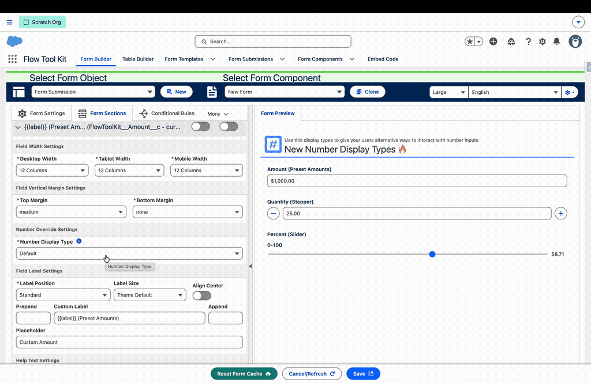

# Release 3.241

A quality release: number fields gain interactive stepper, slider, and preset-amount display types, dynamic selector display types turn semantically-named fields into real pickers, text fields learn to render as text areas with clamped read-only display, the icon picker catches up to the full SLDS set, and a batch of fixes lands (percent Min/Max scale, the Display Table Components toggle, and CSS cleanup).

## New

### Number Display Types: Stepper, Slider, Preset Amounts (#254)

Number, currency, and percent fields can now render as something more interactive than a plain input. Set **Number Display Type** in a field's Number Override Settings:

* **Stepper** — minus/plus buttons flank the formatted input. The field's **Step** value sets the increment (set it to `1` so a stepper counts by whole dollars, not pennies); Step never restricts what a respondent can type.
* **Slider** — a draggable range that defaults to 0–100 and honors the field's Min/Max and Step when set.
* **Preset Amounts** — quick-pick chips you define as label/value pairs in the **Edit Preset Amounts** editor, with an optional **Other** chip (turn on Allow Custom Values) that reveals a free-entry input. A value matching no preset auto-selects Other so it is never orphaned.

Currency and percent formatting apply in every mode, the layout adapts to the container width (not just the device), and the full field toolkit — custom labels, help text, required, prompts — works throughout. Formula fields, being read-only, don't offer the overrides. Details: [Field Type Settings](../form-configuration/field-type-settings.md#number-fields).

### Dynamic Selector Display Types (#249)

Fields that store references (an SLDS icon name, an email template, a public image asset, a style sheet) now get real pickers. When a String or Picklist field's API name contains the matching pattern (`icon`, `emailtemplate`, `bannerimage`/`tileimage`/`imageasset`/`assetfile`, or `stylesheet`, case-insensitive), Form Builder offers the corresponding selector in the field's display-type dropdown:

* **Icon Selector**, now offering the complete current SLDS icon set (629 icons added across the utility, standard, and doctype groups)
* **Email Template Selector**, listing templates related to the form's object
* **Image Asset Selector**, listing the org's public image assets
* **Style Sheet Selector**, listing style-sheet static resources

The chosen value saves with the form like any other answer (no direct record writes), and the standard field toolkit (custom labels with merge fields, help text, required, sizing) applies. Fields named with `formqualifiedapiname` keep their existing automatic form component selector and its Form Selector Settings. Details: [Field Type Settings](../form-configuration/field-type-settings.md#dynamic-selector-overrides).

### Text Fields as Text Areas + Read-Only Height Clamp (#250)

* Any standard Text field can render as a **multi-line text area**: set String Display Type to Text Area, with the character counter, length validation, and Minimum/Maximum Height controls included.
* **Maximum Height** is now available on plain text areas (previously rich text only), and setting it on a long text or rich text field clamps the **read-only** rendering (review screens, read-only forms) into a bordered, scrollable box, so very long content stays contained with an obvious scroll affordance.

Details: [Field Type Settings](../form-configuration/field-type-settings.md#text-area--long-text-area-fields).

## Fixed

### Percent Min/Max captured on the wrong scale (#248)

The Form Builder's Min/Max inputs for percent fields captured values on the decimal scale (0.1 for 10%) while rendered percent fields store whole numbers (10 for 10%), making the constraint meaningless. The builder now captures on the same whole-number scale the field uses.

> **Upgrade note**: percent Min/Max values saved before 3.241 were stored on the decimal scale and should be re-entered once (a saved 0.1 becomes 10).

### Display Table Components toggle had no effect (#251)

The form component selector filtered its options only when they first loaded, so flipping Display Table Components in Form Selector Settings never re-filtered the list. The filter now reapplies whenever the toggle changes, which also fixes the same latent timing gap everywhere the selector is used.

### Styling cleanup (#226, #227)

The package's duplicated button-hover styling now lives in one shared module, and the last legacy `--sds-c-*` styling-hook alias is modernized. No visual changes intended; repeater buttons gain the same standard hover treatment as the rest of the package.
