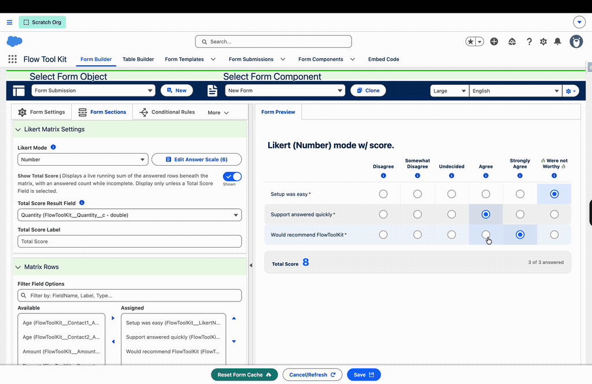
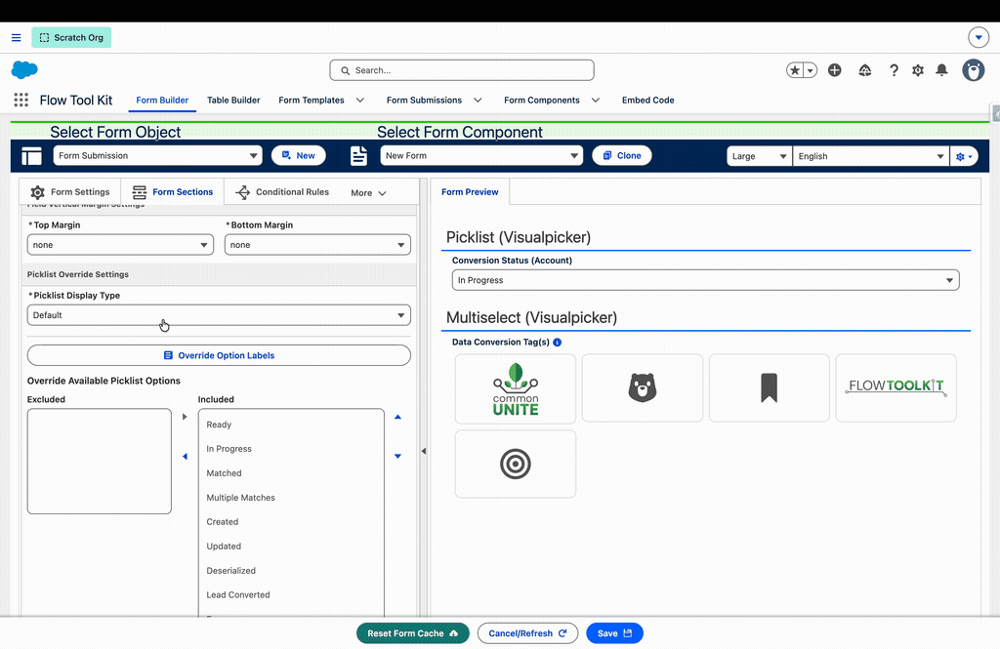
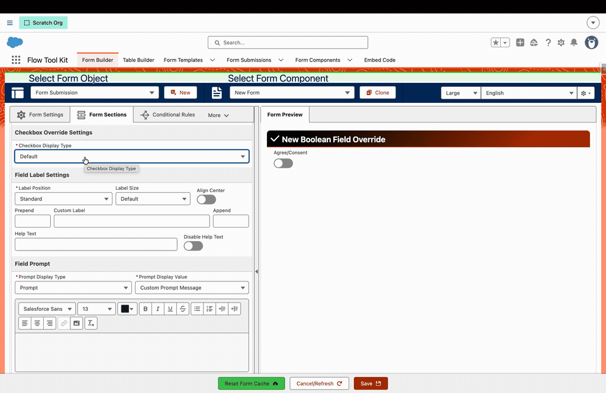
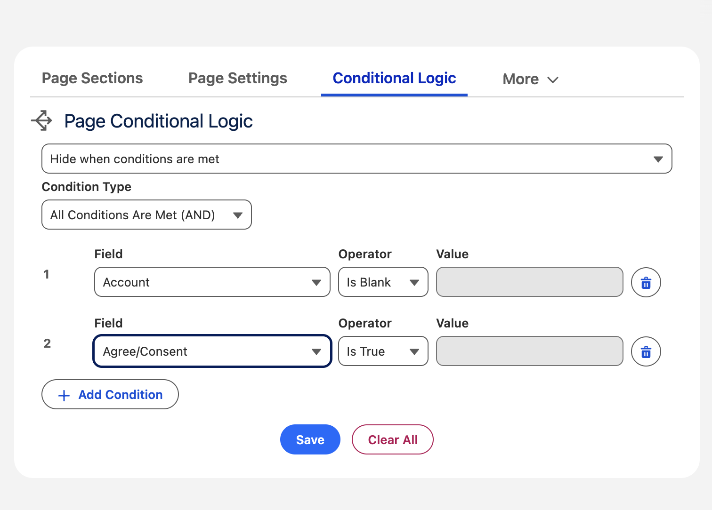

# Flow Tool Kit 4.0: Forms People Finish

> The milestone release: forty-six releases of capability in one upgrade. Applications families complete together, giving pages that feel like giving, surveys that score themselves, and public forms on your own website, all living entirely in Salesforce and extended with Flow, not code.

4.0 is the release where Flow Tool Kit outgrows the word "form builder." What ships here is a way to deliver experiences: a multi-session housing application a family finishes across three evenings and two phones, a donation page where the amounts invite instead of interrogate, a survey that routes a high-risk score before the confirmation page loads, an event registration embedded on your website that lands in Salesforce the instant it is submitted. Every piece runs inside your org, on your data, under your security model, and when your requirements get unusual, your admins extend it with the tool they already know: Flow.

The fastest way to believe it is to use it. **[Open the live demo](https://common-unite.my.site.com/s/form-template/a0fRQ000003mUy9/affordable-housing-land-trust-application?language=en_US)**, a real public affordable-housing application, and spend ninety seconds clicking through stages. No login, no setup.

## ✨ Highlights

### Stages Mode: applications people actually finish

**TL;DR: your longest form becomes a stage overview respondents complete in any order, with progress stored as real Salesforce records your team can see, report on, and automate.**

Picture the longest thing you ask anyone to complete: the housing application, the grant proposal, the annual re-certification. The reason those get abandoned is not the questions, it is the march: page after page with no sense of where the end is. Stages Mode replaces the march with a **stage overview**: every step listed with what it is, how long it takes, and what is already done. A parent starts Household Information on a lunch break, a spouse attaches documents that evening from a phone, and the overview keeps everyone honest about what is left. Build it once and the same pattern carries your intake packets, board applications, compliance renewals, and every other "we mail them a checklist" process still living outside Salesforce.

Delivery is the quiet win. There is no portal project here: Stages Mode is a checkbox on the Form Template, and each page's description, time estimate, and optional flag are fields your admin fills in. Because progress lives in Form Submission Stage records, your staff already have the tools to run the program: a list view of applicants stuck on Documents, a dashboard of completion rates by stage, a record-triggered flow that nudges anyone idle for a week. The application experience and the operations behind it come from the same checkbox.

**Why it's different:**

- **Progress is data, not UI state**: stage status lives on real records, so reports, list views, and record-triggered follow-ups work on day one
- **True collaboration**: several people advance one submission, and **Mark Page Complete** stamps who finished what and when
- **The overview is the navigation**: status badges, time estimates, and descriptions on every stage, and the progress rail's markers double as click-to-navigate
- **Per-template layout options**: hide the progress banner, hide completed fields, or crown the overview with a branded header
- **One checkbox to adopt**: an existing multi-page template becomes a staged application without rebuilding anything

**[Try Stages Mode live](https://common-unite.my.site.com/s/form-template/a0fRQ000003mUy9/affordable-housing-land-trust-application?language=en_US)**: the walkthrough above is a real public application form. Click through the stages, save progress, and mark pages complete, no login required.

📚 [Stages Mode](../form-template-framework/stages-mode.md)

### Life interrupts. Your forms are fine with that.

**TL;DR: work saves itself as people type, and one click emails a private, single-use link that reopens the form exactly where they left it.**

A half-finished form is not a respondent failure, it is a Tuesday: the doorbell rings, the laptop dies, the lunch break ends. In 4.0, work saves itself as people type, a quiet "Draft saved" note keeps them confident, and when they need to walk away, one click emails them a private link that reopens the form exactly where they left it, days later, on any device. Nobody retypes an hour of answers, nobody double-submits, and nobody calls your office asking to start over. It works for logged-in users, for guests, and for forms embedded on your website, which means the people most likely to give up are now the ones most likely to come back.

It also unlocks a delivery pattern you could not build before: launching a form *to* people instead of waiting for them. A record-triggered flow can send start links to a whole list, so two hundred members receive their renewal already tied to their record, open it without logging in, and finish it across as many sittings as they need. Your team writes zero code, controls every email template, and the tokens take care of themselves.

**Why it's different:**

- **Autosave that respects your org**: debounced on change, checkpointed on a timer, and never writing when nothing changed
- **Links safe enough to email**: single-use, cryptographically random, cleared on use, expired after seven days
- **Guests included**: the users you cannot ask to log in, and embedded forms, are covered
- **Invitation-ready**: a record-triggered flow sends start links, turning any list into launched, prefilled drafts
- **Admin-owned messaging**: per-template email templates, no code

📚 [Save and Resume Forms](../form-template-framework/how-to/save-and-resume-forms.md)

### Ask like a survey. Store like Salesforce.

**TL;DR: surveys are now just forms: Likert grids, tap-friendly answer cards, and visual pickers whose every answer is Salesforce field data the moment it is tapped.**

Survey tools usually mean another vendor, another export, another "we'll sync it later." The Survey Suite makes the survey a form: **Likert Matrix sections** render a battery of same-scale questions as one clean grid, **Survey Buttons** turn picklists into tap-friendly cards that never collapse into a dropdown on a phone, and **Visual Picker** makes choices you can see instead of read. Build intake assessments, satisfaction surveys, screening questionnaires, and quizzes in the same builder as everything else, with the same conditional logic, merge fields, and themes.

The delivery story is what the third-party tools cannot match: there is no sync. Every tap lands in a real field on a real record the moment it happens, so reports, dashboards, and automation see answers with zero import steps. Scored mode goes further: it totals live as the respondent clicks and stamps the result into a number field, which means a triage flow can route a high-risk intake to a case manager before the confirmation page has finished loading.

**Why it's different:**

- **No import step, ever**: every answer is ordinary field data on the submission the instant it is given
- **Scored surveys drive automation**: a custom answer scale, a live total row, and a Total Score Result Field any flow can react to, zero code
- **Survey Buttons stay buttons**: full-width option cards that never collapse to a dropdown on phones
- **Visual Picker**: icon or image cards with hover label reveal and brand-color selection; multiselects get checkbox behavior
- **The whole form toolkit applies**: conditional logic, merge fields, prefill, and themes work inside surveys because surveys are forms

📚 [Likert Matrix Sections](../form-configuration/likert-matrix-sections.md) · [Field Type Settings](../form-configuration/field-type-settings.md)

### A number is a decision, not a data entry task

**TL;DR: any number, currency, or percent field can render as preset amount chips, a stepper, or a slider, with true currency and percent formatting in every mode.**

A donation amount, a ticket quantity, a percent allocation: these are moments where someone decides, and a bare text box does nothing to help them. Now any number, currency, or percent field can render as **preset amount chips** (the giving-page pattern, with an Other chip for the generous), a **stepper** with real minus and plus buttons, or a **slider** for anything on a scale. Build the giving page with suggested amounts that light up in your brand color, the volunteer signup that counts seats with plus and minus, the budget worksheet where allocations slide instead of type.

And because these are display overrides on the fields you already have, delivery is a dropdown, not a migration. No schema changes, no parallel fields, no validation rework: the same field your reports, rollups, and conversion flows have always read now simply asks better. Currency symbols and percent signs stay true in every mode, so the form reads like money instead of math.

**Why it's different:**

- **Purely visual overrides**: the field, its validation, and every report on it are untouched
- **Preset chips with a smart Other**: a prefilled value matching no chip auto-selects Other, so nothing is ever orphaned
- **Increments never restrict typing**: a stepper counting by fives still welcomes $12.50 typed directly
- **Formatting follows the field**: currency symbols and percent signs in every mode
- **Container-aware layout**: adapts to the space the form actually has, from full page to narrow sidebar

📚 [Field Type Settings: Number Fields](../form-configuration/field-type-settings.md#number-fields)

### Your website just became a Salesforce form

**TL;DR: paste one generated snippet into any website and a real Salesforce form runs there, writing records the instant someone clicks submit.**

The forms on your public website no longer need to live in a separate product with a nightly sync and a reconciliation spreadsheet. Open the **Embed Code Generator**, pick a Flow, Form Template, or Record Form, copy one snippet, and paste it into WordPress, Squarespace, or hand-rolled HTML. Build the volunteer signup on your marketing site, the contact form that creates real leads, the event registration a campaign email points at, even a payment hand-off that captures the Stripe confirmation, all running your actual Salesforce forms with their conditional logic, themes, and prefill intact.

For delivery, the whole conversation with your web team is one snippet. There is no middleware to license, no field mapping to maintain, no "we'll pull the leads in on Friday." Visitors see a form that simply belongs to the page: it sizes itself, keeps bots out with reCAPTCHA, and pairs with URL Parameter Mapping so the UTM codes on the link arrive on the submission for free. Your website and your org stop being two systems.

**Why it's different:**

- **One snippet, any site**: WordPress, Squarespace, or hand-rolled HTML
- **Submissions are records instantly**: no sync, no export, no reconciliation
- **The frame behaves**: auto-resizes with the form and publishes completion events the host page can react to
- **Attribution built in**: pairs with URL Parameter Mapping to capture UTM codes and campaign parameters
- **Guest-safe by design**: guest-user security respected end to end, org-wide reCAPTCHA in one custom setting

📚 [Iframe Embed](../advanced-topics/iframe-embed.md)

### The one that makes it yours: extend with Flow, not code

**TL;DR: an admin-built flow runs before every form render: prefill anything, gate entry with your own rules, and hand in-progress drafts to resume links.**

Every organization eventually asks its forms to do something no product anticipated: "only returning volunteers should see this," "pull their household from last year," "if they already applied, stop them politely." In most form tools, that sentence starts a development project. In Flow Tool Kit, it starts a flow. Every Form Template can name a **Prefill Flow**: an autolaunched flow or screen flow that runs before the form renders, built entirely in Flow Builder. Your flow receives the working Form Submission, already carrying the template's prefill values and any URL parameters, and whatever it returns becomes the form's starting state. Greet a returning user with a half-completed form. Seed repeater and table sections with their related records. With the screen-flow variant, put a welcome page, terms acceptance, or a custom eligibility check in front of the form itself.

The same contract handles validation. Set `hasError` with a rich-text `errorMessage` and the form never renders; the respondent sees your message on a branded error illustration instead: "you have already submitted," "applications for this program are closed," "this invitation was for someone else." One recipe worth stealing: when your flow finds an in-progress draft, hand off to the packaged send-resume-link flow and tell the respondent a resume link is waiting in their inbox. They return to their exact saved state instead of starting over or double-submitting.

Because it is ordinary Flow, it scales like Flow. Point every template at one shared prefill flow or give each template its own, and factor the common pieces (user matching, eligibility rules, draft detection) into subflows you reuse everywhere. Clonable starters ship in both autolaunched and screen-flow forms, a five-variable contract keeps the surface small, and a matching **Guest Save Override** flow defines the DML interface for guest saves: subscribers elevate deliberately, the package never does. This is the reason Flow-first orgs choose Flow Tool Kit: when the requirements get weird, your admins keep going instead of opening a ticket. Don't sleep on this feature.

**Why it's different:**

- **Runs before render**: an autolaunched or screen flow you build entirely in Flow Builder
- **Prefill anything**: user records, URL parameters, and prefill template values all meet in one input variable
- **Seed related records**: fill repeater and table sections, routed by migration-safe Section Tags
- **Gate the form**: set `hasError` and a rich-text message ("already submitted," "not eligible") and the form never renders
- **Resume-link recipe**: detect an in-progress draft and email the respondent back to their saved state
- **Scales like Flow**: shared or per-template flows, reusable subflows, clonable starters in both flavors

📚 [Prefill Flow](../form-template-framework/prefill-flow.md)

### Build one form. Run your whole program calendar on it.

**TL;DR: one Form Template serves every campaign, event, program, or cohort, with each record carrying its own dates, branding, prefill, and messaging.**

Fifty events this year should not mean fifty registration forms. With **Form Template Sources**, one template serves them all: each campaign, event, program, or cohort record carries its own name, dates, availability window, branding, prefill values, and confirmation messaging, and the form adapts to whichever record it is opened from. Build a single event registration for the year's whole calendar, one program application across every cycle, one grant form across every funding round, on standard Campaign out of the box or any custom object with one metadata record.

Then hand the keys to the people running the programs. The **Template Source Editor** lives on the source record page with tabbed navigation, auto-save, and a live preview, so an events coordinator sets their own dates, writes their own confirmation message, and previews their own form without touching Form Builder or filing an admin request. Close a campaign's end date and its form stops accepting submissions that instant. Every submission is stamped with the record that generated it, so attribution and follow-up automation come for free.

**Why it's different:**

- **Any object can be a source**: standard Campaign ships ready to use; a single metadata record teaches the framework any custom object
- **Program staff self-serve**: the Template Source Editor runs on the record page with auto-save and a live form preview
- **Availability follows the record**: dates and an active flag open and close the form instantly, with a per-source offline message
- **Per-source everything**: name, theme, prefill values, confirmation message, and email template
- **Attribution built in**: every submission stamps its source record for reporting and conversion automation

📚 [Form Template Sources](../form-template-framework/form-template-sources.md)

### Your brand, down to the pixel

**TL;DR: each Form Template carries its own scoped CSS, so one org can serve a gala invitation and a corporate intake form that never bleed into each other.**

A gala invitation should not look like a support ticket. With **Per-Template Style Sheets**, each Form Template carries its own CSS: one template can look like a wedding invitation while another stays corporate, on the same org. Build the sub-branded program application, the white-labeled partner form, the seasonal campaign page whose look changes without touching anything else you run. Combined with themes for the broad strokes, your designers get real control instead of "close enough."

The delivery risk that usually makes admins ban custom CSS is gone by construction: every sheet is scoped to its own template's output, so a rule aimed at one form cannot restyle another form or the page hosting it. An install-only starter stylesheet ships un-managed so upgrades never overwrite your work, stable style hooks mark every field wrapper and container as dependable targets, and the reorganized [Custom Styling Overview](../form-configuration/custom-styling-overview.md) maps every layer of the cascade. The form your donors see can finally match the brand your designers built.

**Why it's different:**

- **CSS per template**: pick a style-sheet static resource from a grouped, described selector on the template
- **Scoping by construction**: one template's look cannot leak into other forms or the page around it
- **Upgrade-safe starter**: ships un-managed, so package upgrades never overwrite your customizations
- **Stable style hooks**: every field wrapper and the template container are dependable CSS targets
- **One documentation hub**: the Custom Styling Overview maps every layer of the styling cascade

📚 [Custom Styling Overview](../form-configuration/custom-styling-overview.md)

---

## 🆕 New Features

The spotlights are the headline act, but forty-six releases added capability everywhere. Skim the bold text: every line below is something you can turn on today.

### Form Building & Display Types

- **Custom Picklist Option Labels**: per-form display wording for any picklist or multiselect while stored values keep their API names; labels run through the merge pipeline and re-render live as other answers change. (3.239) 📚 [Picklist Option Labels](../form-configuration/picklist-option-labels.md) 
- **Attestation display type**: booleans render as a clickable consent card: checkbox beside a rich-text statement, brand-color fill when checked. (3.234) 
- **Dynamic Selector display types**: fields named for icons, email templates, image assets, or style sheets get real pickers, including the complete SLDS icon set (629 icons added). (3.241) 📚 [Field Type Settings](../form-configuration/field-type-settings.md#dynamic-selector-overrides)
- **Text fields as Text Areas**: any standard Text field renders multi-line with counter and height controls; Maximum Height clamps read-only long text into a scrollable box. (3.241)
- **Review Display Type**: design read-only "review your answers" screens in the same WYSIWYG editor. (3.210)
- **Question & Section Numbering**: `{{fieldnumber}}` / `{{sectionnumber}}` merge fields count visible fields and renumber live as conditional logic changes. (3.239)
- **Inline Label Width**: a per-field slider (10–90%) aligns inline labels on a shared edge. (3.227)
- **Per-field Help Text display modes**: Hover Bubble, Below Label, or Below Field. (3.234)
- **Boolean toggle Label Position**: Above / Left / Right with rich-text label support. (3.234)
- **Theme Label Color + Default Label Size**: a theme paints and sizes every label in a form. (3.234)
- **LWC Section Type**: embed any custom Lightning Web Component inside a form section with live record data, change events, and validation. (3.213) 📚 [LWC Section Type](../advanced-topics/lwc-section-type.md)
- **Section Divider Styles**: 12 designed, theme-driven divider styles with rich-text labels and icons. (3.234) 
- **Rich Text Message Cards**: render rich text as themed info/warning/error/success status cards. (3.234) 
- **Record Compare for quizzes**: compare submitted values against a stored answer key. (3.196)

### Form Templates & Pages

- **Form Template Page Conditional Logic**: show or hide entire pages from Form Submission values with an expression builder; navigation, stages, and outputs adjust automatically. (3.211)  📚 [Page Conditional Logic](../form-template-framework/page-conditional-logic.md)
- **Native Page Sections configurator**: live-preview add/reorder/delete on the record page, replacing the old screen flow; up to 15 sections per page; Display Text and LWC section types; in-place Customize modal. (3.234)
- **Form Templates on any record page**: dynamic Related Field resolution walking lookups up to grandparents, plus a fallback template for App/Home pages. (3.239)  📚 [Host a Form on a Record Page](../form-template-framework/how-to/host-form-on-record-page.md)
- **URL Parameter Mapping**: map query parameters (pv1–pv9, UTM, payment intents) into form values on template load. (3.217) 📚 [URL Parameter Mapping](../form-template-framework/url-parameter-mapping.md)
- **Stage Mode Layout options**: hide the progress banner, hide completed fields, or show a branded template header per template. (3.239)
- **Final Submit Button Label**: label the true final submit distinctly from the button that opens review. (3.239)
- **Carousel Finish Button**: configurable finish action on the last carousel section with full-form validation. (3.211)

### Data, Conversion & Automation

- **Record-Based Components**: form/table/repeater configurations stored as real records, the foundation of the JSON-config architecture. (3.200)
- **Form Conversion Templates + Log Conversion Event**: the conversion pipeline's template plumbing and packaged event logging, later upgraded with log-only mode, a return platform event for external orchestration, and 200-request bulk safety. (3.199 → 3.239)
- **Fifteen self-documenting conversion flows**: every packaged flow and 500+ elements carry admin-facing descriptions; all call the logging action directly. (3.239) 📚 [Overridable Conversion Flows](../form-template-framework/how-to/overridable-conversion-flows.md)
- **Get SObject Type action**: record Id in, SObject API name out, in memory (~1ms). (3.210)
- **Flow Invoker action**: launch an autolaunched Flow from anywhere. (3.200)
- **Form (Navigate) action**: one LWC action with Web Page / Record Page / Experience Page modes replaces three Aura actions. (3.222)
- **Flow Tool Kit Settings**: org-wide hierarchy custom setting, starting with the Google reCAPTCHA site key. (3.220)

### Scheduling & Specialized Inputs

- **Schedule Mode for the Date/Time Picker**: generate calendar slots from configuration (days, times, ranges, skip dates) with no pre-fetched records. (3.206) 📚 [Date Time Picker](../screen-components/date-time-picker.md)
- **Three-mode form configuration**: Component / Variable / Custom JSON across form, table, and repeater, in Flow and Experience Cloud, with a unified configurator and a standalone JSON editor. (3.206)
- **Hide State/Province for stateless countries** in address sections. (3.200)

### Experience & Polish

- **Scroll Into View**: forms scroll smoothly into view on each render; templates scroll to top on page navigation. (3.231, 3.229)
- **Gradient Header Theme**: un-themed headers get a brand-aware gradient; themed headers can opt in. (3.219)
- **Spinner illustration + Auto-Navigate**: a full-screen branded loading overlay and auto-advance after async work. (3.222)
- **Approval illustration scene**. (3.197)
- **Loading overlay during prefill**: instant render with a delayed spinner while the prefill flow runs. (3.230)

---

## 📈 Improvements

The refinements you feel without noticing: faster builders, friendlier mobile forms, and accessibility that holds up to a screen reader.

### Builder & Admin Experience

- Form Builder and pickers no longer truncate at 61 forms per object; flat queries replace the capped subquery. (3.226)
- The section customize experience (Actions, Conversion Rules, Repeater/Table Settings) is driven by flowForm JSON configurations with an extensible Client Conversion Config slot. (post-3.241)
- Object selector groups the four framework objects under **Form Template Framework**, separate from your custom objects. (3.241)
- Static text accepted where variables were once required: header titles, button labels, calendar labels. (3.210, 3.206, 3.231)
- Searchable comboboxes, dual listboxes, breadcrumb navigation, and date/multiselect inputs across the property editors. (3.197, 3.206)
- Consistent Top/Bottom Margin controls on every visible component. (3.208)
- Admins bypass the platform cache and always see fresh metadata. (3.199)
- Attestation rich-text editing gains a code-snippet button and a persisted Rich/Plain toggle. (3.235)

### Performance

- Platform-cache expansion for conditional logic, sections, and form values; daily cache reset scheduled on install. (3.205)
- Data table: single-pass categorization and O(n) tree-view lookups. (3.205)
- Targeted `describeSObjects` replaces global describes; bulk static-resource and picklist queries replace N+1 chains. (3.205)
- Date/Time Picker and property-editor hot paths cached and de-quadraticized. (3.206)

### Accessibility & Mobile

- Screen-reader wiring: labels and help text programmatically linked, including radio/checkbox group names. (3.239)
- Radio group keyboard navigation follows the WAI-ARIA roving-tabindex pattern. (3.231)
- Encrypted and custom-lookup fields are keyboard-tabbable. (3.229)
- Mobile docked buttons keep Next/Submit visible with Save Progress in the overflow menu; safe-area padding for the iPhone home indicator. (3.231, 3.216)
- Vertical stage indicators expose real percent-complete to assistive tech. (3.239)

### Theming & Rendering

- Theme overrides, label colors, and custom style sheets reach JSON-rendered page sections on every render path. (3.235)
- Address pickers match name-based address fields (NPC and industry patterns). (3.215)
- Encrypted fields route through the UI API for platform-standard masking. (3.227)
- Repeater calculated totals render immediately on Experience Cloud. (3.227)
- Stages buttons, overview subtitle, and scroll-into-view refinements. (3.231)
- Resume-link email recipient resolution falls through four sources. (3.239)

---

## 🛠️ Fixes

Eighty-six fixes shipped across the range. The ones you would have noticed:

- **CRITICAL: components added to new flows failed to save**: Flow Builder on newer API versions corrupted the auto-assigned Record input; all eleven property editors now normalize both formats. Every org that builds new flows should be past 3.239. (3.239)
- **Form template saves for standard and guest users**: the packaged save flow now ships active; a new unique identifier restores its original replay-safe design. (3.241)
- **Lightning Out guest forms were completely broken**: a Locker Service double-proxy violation, fixed across 17 components with zero extra network calls. (3.215)
- **Config values rejected on upgraded orgs**: internal config picklists are now unrestricted, permanently future-proofing new options. (3.238)
- **Duplicate submissions** for non-guest users on Return / Save Progress / Mark Complete, and guest/iframe first-save reliability. (3.231)
- **Form Builder crashes**: repeater/table preview crash, record-page config rendering, JSON save cloning itself on every save, cross-org config paste, fast-navigation form wipe. (3.237–3.241)
- **Form Template section overlap**: a legacy negative margin painted each section over its neighbor. (3.241)
- **File uploads**: second upload overwriting the first, conditional logic support, fault handling, preview-link and deletion controls. (3.211–3.212)
- **reCAPTCHA in embeds**: works on external sites, with a timeout safeguard and one-setting org-wide key. (3.220–3.221)
- **SPA navigation state**: Experience Cloud record navigation resets accumulated state. (3.206)
- **Percent Min/Max scale**, phone validation on blur, theme heading colors under SLDS2, address review crash, encrypted-field focus traps, LWR navigation errors, stage indicator reverts, radio overflow on rounded corners, and dozens more small paper cuts. (throughout)

---

## 📚 Documentation

Everything above is documented on this site. Start at [Feature Overview](../welcome/feature-overview.md), then:
[Stages Mode](../form-template-framework/stages-mode.md) · [Save & Resume](../form-template-framework/how-to/save-and-resume-forms.md) · [Prefill Flow](../form-template-framework/prefill-flow.md) · [Likert Matrix](../form-configuration/likert-matrix-sections.md) · [Field Type Settings](../form-configuration/field-type-settings.md) · [Picklist Option Labels](../form-configuration/picklist-option-labels.md) · [Custom Styling](../form-configuration/custom-styling-overview.md) · [Iframe Embed](../advanced-topics/iframe-embed.md) · [LWC Section Type](../advanced-topics/lwc-section-type.md) · [Page Conditional Logic](../form-template-framework/page-conditional-logic.md) · [Conversion Flows](../form-template-framework/how-to/overridable-conversion-flows.md)

## Try it, then upgrade

Ninety seconds in the **[live demo](https://common-unite.my.site.com/s/form-template/a0fRQ000003mUy9/affordable-housing-land-trust-application?language=en_US)** will tell you more than anything written here. When you are ready, 4.0 is flagged as the package's recommended version: open Setup → Installed Packages → **Upgrade to Recommended Version**, and everything above arrives in one click.
