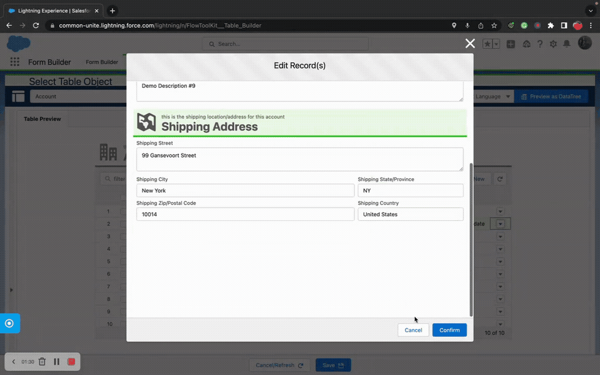

# Data Table
> A fully featured, metadata-driven data table for managing record collections on Flow Screens.

## Overview

Data Table (also known as Flow Data Table) lets you display, edit, create, delete, and clone records in a table format — all within a Flow Screen. Like Flow Form, it uses the same Form metadata to define which columns appear and how they behave, giving you a consistent editing experience between forms and tables.

Data Table is ideal for scenarios where users need to work with multiple records at once: line items on an order, contacts on an account, tasks in a project, or any parent-child relationship. It supports inline editing, bulk operations, hierarchy trees, row selection, search/filter, custom buttons, and column calculations.

The component tracks all changes in separate output collections — records to insert, update, and delete — so your Flow can perform the right DML operation for each record.

## Where to Use It

- **Flow Screen** (primary target)

## Video Walkthrough



## Quick Start

1. **Create a Form** — In the Form Builder, create a Form for your object with the fields you want as columns. Set `type` to "table" on the Form metadata.
2. **Add Data Table to a Screen** — In Flow Builder, drag "Data Table" onto your screen.
3. **Configure** — Select your object and the Form you created. Set action permissions (allow new, edit, delete, etc.).
4. **Prefill Records** — Assign a record collection variable to `prefillRecords` to display existing data.
5. **Process Changes** — After the screen, use `insertCollection`, `updateCollection`, and `deleteCollection` to perform the appropriate DML.

## Properties

### Inputs

| Property | Type | Required | Default | Description |
|---|---|---|---|---|
| `object` | String | Yes | — | SObject API name (e.g., "Opportunity") |
| `formQualifiedApiName` | String | Yes | — | QualifiedApiName of the Form metadata for column definitions |
| `formJSON` | String | No | — | Form definition as JSON (alternative to metadata) |
| `formJsonEnabled` | Boolean | No | false | Use `formJSON` instead of `formQualifiedApiName` |
| `dynamicFormSelectorEnabled` | Boolean | No | false | Allow dynamic form selection via a variable |
| `prefillRecords` | SObject[] (Generic T) | No | — | Collection of records to display in the table |
| `recordTemplate` | SObject (Generic T) | No | — | Template record with default values for new rows |
| `recordTypeOptions` | RecordType[] | No | — | Available record types for the Record Type picklist |
| `max` | Integer | No | — | Maximum number of records allowed in the table |
| `min` | Integer | No | — | Minimum number of records required (validation) |
| `minRowSelection` | Integer | No | — | Minimum rows that must be selected to proceed |
| `maxRowSelection` | Integer | No | — | Maximum rows that can be selected |
| `selectionReturnFieldValue` | String | No | — | Field API name whose values populate selection outputs |

#### Display Options

| Property | Type | Required | Default | Description |
|---|---|---|---|---|
| `displayAsDataTree` | Boolean | No | false | Display as a hierarchy tree instead of flat table |
| `hierarchyFieldName` | String | No | — | Parent lookup field for tree display (e.g., "ParentId") |
| `treeHideCollapseButtons` | Boolean | No | — | Hide collapse/expand buttons, show all expanded |
| `showRowNumberColumn` | Boolean | No | — | Show row numbers |
| `showCheckBoxColumn` | Boolean | No | — | Show checkbox selection column |
| `hideTableHeader` | Boolean | No | — | Hide column headers |
| `hideTableFooter` | Boolean | No | — | Hide the table footer |
| `tableRowClass` | String | No | — | Custom CSS class for table rows |
| `tableHeight` | Integer | No | — | Fixed table height in pixels (enables scrolling) |
| `minRowHeight` | Integer | No | 5 | Minimum row height |
| `recordsToLoad` | Integer | No | — | Number of records to load initially |
| `disableColumnResize` | Boolean | No | — | Prevent users from resizing columns |
| `minColumnWidth` | Integer | No | — | Minimum column width in pixels |
| `maxColumnWidth` | Integer | No | — | Maximum column width in pixels |
| `urlTarget` | String | No | — | Target for URL field links |
| `disableRowActionIndicators` | Boolean | No | false | Hide row action indicator icons |
| `bypassPrefillMaintain` | Boolean | No | false | Bypass prefill collection maintenance |

#### Search & Filter

| Property | Type | Required | Default | Description |
|---|---|---|---|---|
| `enableFilter` | String | No | — | Enable search/filter functionality |
| `minSearchString` | Integer | No | — | Minimum characters before filtering begins |

#### Action Permissions

| Property | Type | Required | Default | Description |
|---|---|---|---|---|
| `allowNew` | Boolean | No | — | Show the "New" action button |
| `allowEdit` | Boolean | No | — | Show the "Edit" action button |
| `allowBulkEdit` | Boolean | No | — | Show the "Bulk Edit" action button |
| `allowDelete` | Boolean | No | — | Show the "Delete" action button |
| `allowBulkDelete` | Boolean | No | — | Show the "Bulk Delete" action button |
| `allowClone` | Boolean | No | — | Show the "Clone" action button |
| `allowReset` | Boolean | No | — | Show the "Reset" action button |
| `allowBulkReset` | Boolean | No | — | Show the "Bulk Reset" action button |
| `allowResetTable` | Boolean | No | — | Show the "Reset Table" action button |

#### Action Labels

| Property | Type | Description |
|---|---|---|
| `newButtonLabel` | String | Custom label for the New button |
| `editButtonLabel` | String | Custom label for the Edit button |
| `deleteButtonLabel` | String | Custom label for the Delete button |
| `cloneButtonLabel` | String | Custom label for the Clone button |
| `resetButtonLabel` | String | Custom label for the Reset button |

#### Navigation Behavior

| Property | Type | Description |
|---|---|---|
| `navigateOnSelect` | Boolean | Auto-navigate when a row is selected |
| `navigateOnNew` | Boolean | Auto-navigate after creating a new record |
| `navigateOnEdit` | Boolean | Auto-navigate after editing a record |
| `navigateOnDelete` | Boolean | Auto-navigate after deleting a record |
| `navigateOnClone` | Boolean | Auto-navigate after cloning a record |
| `navigateOnReset` | Boolean | Auto-navigate after resetting a record |

#### Modal Customization

| Property | Type | Description |
|---|---|---|
| `editModalHeading` / `editModalSubheading` | String | Modal title/subtitle for Edit |
| `newRecordModalHeading` / `newRecordModalSubheading` | String | Modal title/subtitle for New |
| `cloneRecordModalHeading` / `cloneRecordModalSubheading` | String | Modal title/subtitle for Clone |
| `deleteModalHeading` / `deleteModalSubheading` / `deleteModalBody` | String | Modal title/subtitle/body for Delete |
| `resetModalHeading` / `resetModalSubheading` / `resetModalBody` | String | Modal title/subtitle/body for Reset |
| `resetTableModalHeading` / `resetTableModalSubheading` / `resetTableBody` | String | Modal title/subtitle/body for Reset Table |
| `disableDeleteModalMessage` | Boolean | Skip the delete confirmation dialog |

#### Header & Styling

| Property | Type | Default | Description |
|---|---|---|---|
| `title` | String | — | Table header title |
| `subtitle` | String | — | Table header subtitle |
| `helpText` | String | — | Help text display |
| `showHeader` | Boolean | — | Show the table header |
| `iconName` | String | — | SLDS icon for the header |
| `topMargin` | String | — | Top margin SLDS class |
| `bottomMargin` | String | slds-m-bottom_none | Bottom margin SLDS class |
| `themeOverrideName` | String | — | Theme for edit/new forms |
| `themeHeaderName` | String | — | Theme for the table header |
| `enableAccordion` | Boolean | false | Wrap form sections in accordions |
| `requireAll` | Boolean | false | Make all fields required |
| `disableAll` | Boolean | false | Disable all editing |
| `displayPrompts` | Boolean | false | Show field help prompts |
| `languageOverride` | String | — | Override system language |

### Outputs

| Property | Type | Description |
|---|---|---|
| `prefillRecords` | SObject[] (Generic T) | The current full collection (input + changes) |
| `insertCollection` | SObject[] (Generic T) | New records created by the user |
| `updateCollection` | SObject[] (Generic T) | Existing records modified by the user |
| `deleteCollection` | SObject[] (Generic T) | Records marked for deletion |
| `prefillCollectionSize` | Integer | Total record count (excludes deleted) |
| `insertCollectionSize` | Integer | Count of new records |
| `updateCollectionSize` | Integer | Count of updated records |
| `deleteCollectionSize` | Integer | Count of deleted records |
| `recordsCollectionChangedTrigger` | DateTime | Timestamp on any collection change (use as trigger) |
| `updateCollectionChangedTrigger` | DateTime | Timestamp on update changes |
| `insertCollectionChangedTrigger` | DateTime | Timestamp on insert/clone changes |
| `deleteCollectionChangedTrigger` | DateTime | Timestamp on delete changes |
| `calculationResultRecord` | SObject (Generic T) | Record containing column calculation results |
| `activeRow` | SObject (Generic T) | The row currently being edited/created/cloned |
| `firstSelectedRow` | SObject (Generic T) | The first selected row |
| `selectedRecords` | SObject[] (Generic T) | All selected rows |
| `selectedCollectionSize` | Integer | Count of selected records |
| `selectedRecordsIds` | String[] | Array of selected record Ids |
| `selectedRecordsIdsString` | String | Comma-separated selected record Ids |
| `selectedRecordsValues` | String[] | Array of field values for selected rows |
| `selectedRecordsValuesString` | String | Comma-separated field values for selected rows |
| `action` | String | Last action performed: clone, delete, massDelete, edit, massEdit, new, reset, massReset, resetTable |
| `buttonClicked` | Button (Apex-Defined) | The custom button that was clicked |
| `buttonClickedLabel` | String | Label of the clicked custom button |
| `buttonClickedValue` | String | Value of the clicked custom button |
| `buttonClickedDateTime` | DateTime | Timestamp of button click |
| `searchValue` | String | Current search/filter text |

## How It Works

**Collection Tracking**: Data Table maintains three separate output collections — `insertCollection` (new records), `updateCollection` (modified records), and `deleteCollection` (removed records). After the screen, loop through each collection and perform the corresponding DML operation.

**Inline Editing**: When a user clicks Edit on a row, a modal opens with the form defined by your Form metadata. Changes are saved to the in-memory collection and reflected in the table immediately. The actual database save happens when your Flow processes the output collections.

**Hierarchy Trees**: Set `displayAsDataTree=true` and specify a `hierarchyFieldName` (like "ParentId" for Account) to display records in a collapsible tree structure showing parent-child relationships.

**Calculations**: The table supports column-level calculations (SUM, AVG, MIN, MAX, COUNT) configured in the Form metadata. Results are output in the `calculationResultRecord`.

## Works With

| Component | Integration |
|---|---|
| **Flow Form** | Uses the same Form metadata for column/field definitions |
| **Custom Buttons** | Supports custom button collections with click outputs |
| **Lookup Table** | Lookup fields in table rows use the Lookup Table for selection |
| **Form Templates** | Can be embedded in Form Template page sections |
| **Themes** | Applies Form Theme styling to the table header and edit forms |

## Common Patterns

### 1. Order Line Items
Prefill with existing line items. Enable New, Edit, Delete. After the screen, process `insertCollection` with Create Records, `updateCollection` with Update Records, and `deleteCollection` with Delete Records.

### 2. Record Selection
Set `showCheckBoxColumn=true` and `minRowSelection=1`. Use `selectedRecords` output to pass the user's selection to the next screen or action.

### 3. Account Hierarchy Viewer
Set `displayAsDataTree=true` with `hierarchyFieldName=ParentId`. Prefill with all accounts in a hierarchy. Users can expand/collapse to explore the tree.

## Tips & Considerations

- **Prefill Loop**: Assign `prefillRecords` output back to the same variable as input to maintain state across screen refreshes.
- **Performance**: Tables with 500+ records work fine but may be slower. Use `recordsToLoad` to paginate large datasets.
- **Row Selection Validation**: `minRowSelection` blocks Flow navigation if the user hasn't selected enough rows — this is enforced at the platform level.
- **Bulk Operations**: Bulk Edit and Bulk Delete operate on all selected rows simultaneously, which is much faster than editing one at a time.
- **Column Calculations**: Configure calculations in the Form Builder on numeric fields. Results appear in the table footer and in `calculationResultRecord`.