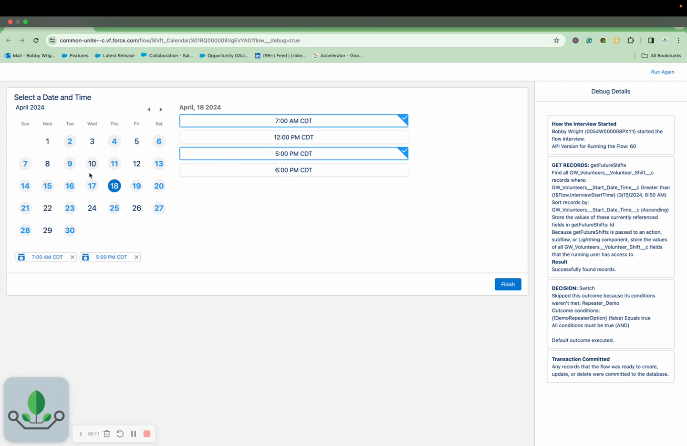
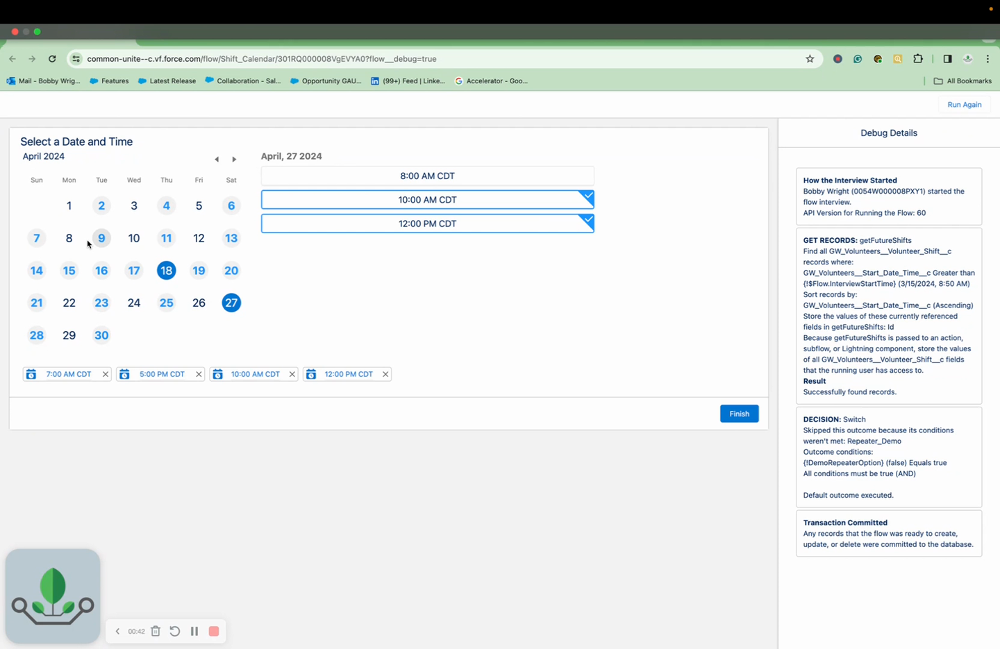

# Date/Time Picker

> A calendar and scheduling component for selecting dates, times, and time slots on Flow Screens.

## Overview

Form (Calendar/Scheduler) displays a visual calendar where users select dates and times from a collection of records. It supports two modes: **Calendar Mode** (select from existing records with DateTime fields) and **Schedule Mode** (generate available time slots from a defined schedule).

The component is ideal for appointment booking, event scheduling, resource availability, and any scenario where users pick dates and times from available options.

## Where to Use It

- **Flow Screen**

## Video Walkthrough



## Properties

### Core Configuration

| Property | Type | Required | Default | Description |
|---|---|---|---|---|
| `prefillRecords` | SObject[] (Generic T) | Yes | — | Collection of records containing DateTime values to display |
| `object` | String | No | — | SObject API name |
| `startDateTimeFieldName` | String | Yes | — | Field API name of the DateTime field on the records |
| `selectorLabelFieldName` | String | No | — | Field API name to use as the display label for each time slot |
| `disabledFieldName` | String | No | — | Boolean field API name — when true, the time slot is disabled |
| `themeFieldName` | String | No | — | String field API name for per-record theme styling |
| `label` | String | No | Select a Date and Time | Calendar title/label |
| `required` | Boolean | No | false | Require at least one selection |
| `maxSelection` | Integer | No | 1 | Maximum number of selections allowed |
| `selectedStartDate` | Date | No | — | Override the initially displayed date |

### Display Options

| Property | Type | Default | Description |
|---|---|---|---|
| `hideCalendarOnSelection` | Boolean | — | Hide the calendar after a selection is made |
| `hide` | Boolean | — | Hide the entire calendar component |
| `hidePills` | Boolean | — | Hide selected record pills |
| `hideSelectors` | Boolean | — | Hide time slot selectors |
| `hideTimeZone` | Boolean | — | Hide the time zone display |
| `navigateOnSelect` | Boolean | — | Auto-navigate to the next screen on selection |
| `topMargin` | String | — | Top margin SLDS class |
| `bottomMargin` | String | — | Bottom margin SLDS class |

### Schedule Mode

| Property | Type | Description |
|---|---|---|
| `times` | String | Semicolon-delimited time slots (e.g., "9:00 AM;10:00 AM;2:00 PM") |
| `scheduleStartDate` | Date | First date to show available slots |
| `scheduleEndDate` | Date | Last date to show available slots |
| `daysOfWeek` | String | Which days to include (e.g., "Monday;Tuesday;Wednesday") |
| `skipDates` | Date[] | Specific dates to exclude (holidays, blocked dates) |

### Outputs

| Property | Type | Description |
|---|---|---|
| `selectedRecords` | SObject[] (Generic T) | All selected records |
| `currentActiveRecords` | SObject[] (Generic T) | Records currently visible on the calendar |
| `hasSelection` | Boolean | True if at least one selection has been made |
| `totalRecordsSelected` | Integer | Count of selected records |
| `selectedRecordIds` | String[] | Array of selected record Ids |
| `selectedRecordDates` | DateTime[] | Array of selected DateTime values |
| `firstSelectedRecord` | SObject (Generic T) | First selected record |
| `firstSelectedDateTime` | DateTime | DateTime value of the first selection |

## Common Patterns

### 1. Appointment Booking
Query available appointment slots, pass them as `prefillRecords`. Set `maxSelection=1`. After the screen, use `firstSelectedRecord` to create a booking record.

### 2. Multi-Day Event Selection
Set `maxSelection` to allow multiple selections. Users pick several dates for a multi-session event. Process `selectedRecords` to create event records for each date.

### 3. Schedule Mode — Office Hours
Use Schedule Mode to generate available slots: set `times` to office hours, `daysOfWeek` to weekdays, and `skipDates` for holidays. No prefill records needed — the component generates the calendar from the schedule definition.

## Tips & Considerations

- **Calendar Mode vs Schedule Mode**: Calendar Mode displays existing records on a calendar. Schedule Mode generates time slots from a schedule definition. Use Calendar Mode when you have records; use Schedule Mode when you need to offer recurring availability.
- **DateTime Field Required**: The `startDateTimeFieldName` must point to a DateTime field (not Date). If your records only have Date fields, use a formula or Flow assignment to create a DateTime value.
- **Performance**: The calendar renders all records passed to it. For very large collections (1000+), consider filtering to a date range before passing records.
