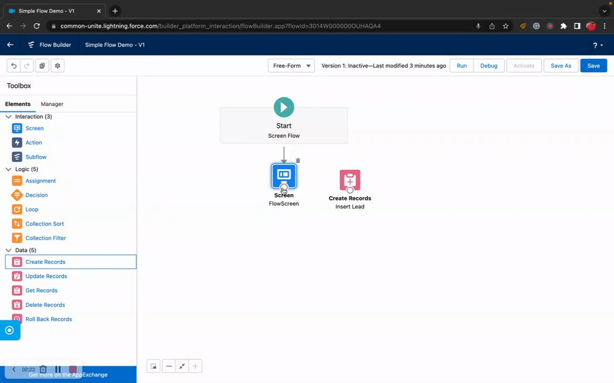
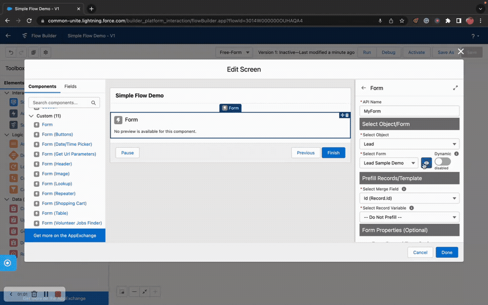

# Flow Form
> The primary form component for building dynamic, metadata-driven forms on Flow Screens.

## Overview

Flow Form is the core component of Flow Tool Kit. It renders a fully functional form on any Flow Screen, driven by metadata you define in the Form Builder or via JSON configuration. Point it at any Salesforce object, select a form component you've built, and it handles field rendering, validation, conditional logic, theming, and record output — all without writing code.

Flow Form works with any standard or custom object. It supports multiple output variants so you can choose exactly which field values to pass downstream in your Flow: all fields, only changed fields, only visible fields, or combinations. It also integrates with other Flow Tool Kit components like Custom Buttons, Data Table, and Header through Lightning Message Channels.

Whether you're building a simple contact form or a complex multi-section intake with conditional visibility, accordion layouts, and real-time validation, Flow Form is the component that makes it happen.

## Where to Use It

- **Flow Screen** (primary target)
- Works in Screen Flows, Auto-launched Flows with screens, and scheduled Flows with screen elements

## Video Walkthrough



## Quick Start

1. **Create a Form Component** — Open the Form Builder tab and create a new form component for your object (e.g., Account). Add sections and fields.
2. **Add Flow Form to a Screen** — In Flow Builder, drag "Flow Form" onto your screen element.
3. **Configure the Component** — In the property editor, select your object and the form component you created.
4. **Map the Record** — Assign a record variable of the matching object type to the `record` input.
5. **Use the Output** — After the screen, reference `{!FlowForm.record}` to get the user's input for Create/Update elements.

## Properties

### Inputs

| Property | Type | Required | Default | Description |
|---|---|---|---|---|
| `formConfiguration` | FormConfiguration (Apex-Defined) | No | — | Form Configuration object for advanced setup |
| `record` | SObject (Generic T) | No | — | Record variable with field values; returns record with all input field values |
| `transformationRecord` | SObject (Generic T) | No | — | Record with dynamic field value changes from other screen components |
| `compareRecord` | SObject (Generic T) | No | — | Record to compare user inputs against for change detection |
| `formQualifiedApiName` | String | Yes* | — | QualifiedApiName of the form component metadata record to render |
| `formJSON` | String | No | — | Form definition as a JSON string (alternative to metadata reference) |
| `formJsonEnabled` | Boolean | No | false | Set to true to use `formJSON` instead of `formQualifiedApiName` |
| `object` | String | Yes | — | SObject API name (e.g., "Account", "Contact") |
| `dynamicFormSelectorEnabled` | Boolean | No | false | Allow the form component name to be set dynamically via a text variable |
| `languageOverride` | String | No | — | ISO language code to override the system language for form labels |
| `recordTypeOptions` | RecordType[] | No | — | Collection of record types to display in the Record Type picklist |
| `themeOverrideName` | String | No | — | QualifiedApiName of a Form Theme metadata record for custom styling |
| `enableAccordion` | Boolean | No | false | Wrap each section in a collapsible accordion |
| `wrapInAccordion` | Boolean | No | false | Wrap the entire form in a single accordion |
| `accordionTitle` | String | No | — | Title for the accordion wrapper (used with `wrapInAccordion`) |
| `titleTemplate` | String | No | — | Template string for accordion section titles (supports merge fields) |
| `title` | String | No | — | Form header title text |
| `subtitle` | String | No | — | Form header subtitle text |
| `helpText` | String | No | — | Help text displayed below the title |
| `iconName` | String | No | — | SLDS icon name for the header (e.g., "standard:account") |
| `richText` | String | No | — | Rich text HTML content for the header area |
| `showHeader` | Boolean | No | — | Display the form header section |
| `scrollIntoView` | Boolean | No | false | When true, the form scrolls into view on render so users always begin a Flow screen at the form header (see [Scroll Into View on Render](#scroll-into-view-on-render)) |
| `topMargin` | String | No | — | SLDS margin class for top spacing |
| `bottomMargin` | String | No | slds-m-bottom_none | SLDS margin class for bottom spacing |
| `showFieldSetDivider` | Boolean | No | — | Show a visual divider between field sets |
| `validateSections` | Boolean | No | false | Validate each section independently |
| `displayPrompts` | Boolean | No | false | Display field-level help prompts (tooltip-style) |
| `preventValidationBypass` | Boolean | No | false | Prevent users from bypassing validation errors |
| `returnVisibleFieldsOnly` | Boolean | No | false | Filter hidden fields from record output |
| `preventNulls` | Boolean | No | false | Remove null/empty values from record output |
| `review` | Boolean | No | false | Display the form in read-only review mode |
| `requireAll` | Boolean | No | false | Make all fields mandatory (overrides individual field settings) |
| `disableAll` | Boolean | No | false | Disable all form fields (read-only mode) |
| `disableAllHeaders` | Boolean | No | false | Disable all section headers |
| `preventDisconnect` | Boolean | No | — | Prevent component disconnect on Flow navigation changes |
| `serverURL` | String | No | — | Salesforce server URL (auto-resolved; needed for Experience Cloud) |

*`formQualifiedApiName` is required unless `formJsonEnabled` is true, in which case `formJSON` is required instead.

### Outputs

| Property | Type | Description |
|---|---|---|
| `record` | SObject (Generic T) | Record with ALL field values — includes prefilled, hidden, merged, and user-entered values |
| `changedRecordFieldsOnly` | SObject (Generic T) | Record containing ONLY the fields the user changed during this screen |
| `hasChangedRecordFields` | Boolean | TRUE if the user modified any field values |
| `changedRecordFieldsDateTime` | DateTime | Timestamp that updates whenever any form value changes (use as a trigger) |
| `recordWithoutNulls` | SObject (Generic T) | Record with null/empty values removed |
| `recordVisibleFields` | SObject (Generic T) | Record with only visible fields (excludes hidden fields, keeps Id) |
| `recordVisibleFieldsWithoutNulls` | SObject (Generic T) | Record with visible fields only and null values removed |
| `initialRecordValues` | SObject (Generic T) | Snapshot of the prefilled values at form load time |
| `guestLanguage` | String | The language selected by a Guest user in Experience Cloud |
| `valid` | Boolean | TRUE when all validation passes (use in Set Component Visibility) |
| `notvalid` | Boolean | TRUE when any validation fails (use in Set Component Visibility) |
| `validRecord` | SObject (Generic T) | Record containing only the field values that passed validation |

## How It Works

**Form Rendering**: When the component loads, it reads the form component metadata (sections and fields) and renders the appropriate input controls for each field based on its data type. Fields like picklists, lookups, dates, and rich text all get purpose-built input controls.

**Validation**: The form validates required fields, data types, min/max values, and custom validation rules. The `valid` and `notvalid` output variables update in real-time and can be used with "Set Component Visibility" to show/hide other screen elements based on form validity.

**Record Outputs**: The form provides multiple output variants to match your downstream needs:
- Use `record` when you need everything (including prefilled and hidden field values)
- Use `changedRecordFieldsOnly` when you only want to update what the user changed
- Use `recordVisibleFields` when hidden fields should not be passed forward
- Use `recordWithoutNulls` before Update elements to avoid overwriting existing values with blanks

**Reactive Updates**: The `transformationRecord` input allows other components on the same screen to push field value changes into the form in real-time. The `changedRecordFieldsDateTime` output fires whenever any value changes, which can trigger downstream reactive components.

## Scroll Into View on Render

When a Flow advances from one screen to the next, the next screen renders but the browser viewport stays at whatever scroll position the user left the previous screen at. On long forms, users often start the next screen mid-page and miss the header / first fields entirely.

The **Scroll Into View** property fixes this. When enabled, the Flow Form smoothly scrolls itself into view so its top edge aligns with the top of the viewport — every render, every screen transition.

### Where to find it

Open the Flow Form custom property editor in Flow Builder, expand **Form Properties (Optional)**, and you'll see the **Scroll Into View** section with a toggle on the right.

### Configuring the toggle

The toggle in the section header sets a literal `true` / `false` value. For dynamic control, use the variable picker just below — bind any Boolean variable, formula, or upstream component output (e.g. another component's `valid` flag, a screen-level Boolean variable, a `$GlobalConstant`).

### Runtime behavior

Once enabled, the form's top edge snaps to the top of the viewport on every render. The animation is smooth (respects `prefers-reduced-motion` for users who have opted out of animations at the OS level).

### When it fires

| Scenario | Scrolls? |
|---|---|
| Screen renders with `scrollIntoView = true` | Yes — once per screen render |
| Screen renders with `scrollIntoView = false` | No |
| Reactive input flips `scrollIntoView` from `false` → `true` after render | Yes — once per transition |
| Reactive input flips `true` → `false` → `true` (multiple times) | Yes — fires on every rising edge |
| Same-value sets (`true → true` with no false in between) | No |
| Re-renders triggered by typing, validation, picklist loads, conditional logic | No — internal re-renders are suppressed |

### When it never fires (by design)

The scroll is suppressed in design-time and embedded contexts where it would be disruptive or wrong:

- **Form Builder preview pane** — would scroll the builder itself
- **Form Builder editor** — wouldn't make sense while editing
- **Repeater rows** — each repeated row would fight the others for the viewport
- **Sub-form rendering inside a parent form** — would scroll past the parent
- **Table-edit mode** — inline edit shouldn't move the page

### Common patterns

- **Long multi-step Flows**: Enable on every Flow Form so users always start at the form header after Next/Previous navigation
- **Conditional jump**: Bind to a Boolean variable that another component toggles — e.g. a "Skip to Form" button on screen 1 sets a variable that drives scrollIntoView on screen 2, forcing a scroll the moment the user lands
- **Reactive validation focus**: Bind to a screen-level Boolean that flips true when an upstream validation error needs the user's attention

### Implementation notes

- The scroll uses `requestAnimationFrame` + `Element.scrollIntoView({ block: 'start', behavior: 'smooth' })` on the form's root element — the same pattern as `formTemplate._scrollFormToTop()`
- The setter detects rising-edge transitions (`false → true`) so reactive flips re-trigger the scroll
- The first render handles the initial-load case (admin enabled the toggle in the builder, form renders true on mount)

## Works With

| Component | Integration |
|---|---|
| **Custom Buttons** | Buttons communicate with Flow Form via the FlowButton message channel to trigger validation and navigation |
| **Data Table** | Data Table can use the same form component metadata for inline editing of table rows |
| **Header** | Header component shares the same theme system and can display above the form |
| **Lookup Table** | Lookup fields in the form open the Lookup Table component for record selection |
| **Form Templates** | Form Templates embed Flow Form for each page section |
| **Conditional Logic** | Conditional Logic metadata controls field/section visibility based on field values |
| **Themes** | Form Theme metadata applies consistent styling across all form elements |
| **Labels** | Form Label metadata provides reusable, translatable text for field labels and help text |

## Common Patterns

### 1. Simple Record Create Form
Add Flow Form to a screen with an Account form component. After the screen, use a Create Records element with `{!FlowForm.record}` to insert the new account.

### 2. Edit Form with Change Detection
Prefill `record` with an existing record. After the screen, check `{!FlowForm.hasChangedRecordFields}` — if true, use `{!FlowForm.changedRecordFieldsOnly}` in an Update Records element to only update what changed.

### 3. Multi-Form Screen
Place multiple Flow Form components on the same screen for different objects (e.g., Contact + Account). Each form operates independently with its own record variable, and they can share data via `transformationRecord`.

### 4. Conditional Review Screen
Set `review` to true on a second screen to display a read-only summary of everything the user entered, then let them go back to edit or proceed to submit.

## Tips & Considerations

- **Always assign an Object**: The `object` property must match the type of your record variable. Mismatched types cause runtime errors.
- **Record Variable Type**: Your record variable must be the same SObject type as the form component's object. The generic type system (`T extends SObject`) enforces this at design time.
- **Null Handling**: If you're updating existing records, consider using `recordWithoutNulls` or the Strip Null Values invocable action to avoid overwriting populated fields with blanks.
- **Performance**: Form components with many fields (50+) or complex conditional logic may take slightly longer to render. Consider splitting into multiple sections or using Form Templates for very large forms.
- **Experience Cloud**: When used inside a Flow embedded in Experience Cloud, set `serverURL` to `{!$Flow.ServerURL}` for proper resource resolution.
- **Language Override**: Use `languageOverride` to serve forms in specific languages. This works with Form Label Translation metadata for multilingual deployments.
- **Dynamic Form Selection**: Enable `dynamicFormSelectorEnabled` to set the form component name from a formula or variable, enabling one screen element to render different form components based on conditions.
