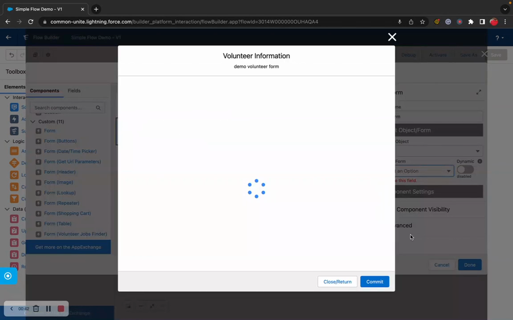

# Form Builder
> The visual WYSIWYG editor for creating and managing form component metadata — the design-time companion to Flow Form and Data Table.

## Overview

Form Builder is the administrative tool where you create, edit, and organize the form component metadata that powers Flow Form and Data Table at runtime. It provides a drag-and-drop interface for defining sections, fields, conditional logic, and styling — all without writing code.

Think of Form Builder as the design surface and Flow Form as the runtime engine. You build your form component layout in Form Builder, and Flow Form renders it as an interactive form for end users. Every form component, section, field, conditional logic rule, theme, and label metadata record can be created and managed through this single interface.

Form Builder is available as a Lightning Tab and can also be embedded on Record Pages for context-specific form component management.

## Where to Use It

- **Lightning Tab** (primary) — access via the "Form Builder" tab in your app
- **Record Page** — embed on a record page for context-specific form component editing

## Video Walkthrough



## Quick Start

1. **Navigate to Form Builder** — Open the Form Builder tab from your Lightning app navigation.
2. **Create a New Form Component** — Click "New Form", select an object (e.g., Account), and give your form component a name.
3. **Add Sections** — Click "Add Section" to create logical groupings for your fields.
4. **Add Fields** — Drag fields from the available field list into your sections, or click to add them.
5. **Configure Field Properties** — Click any field to set properties like label overrides, default values, help text, required, read-only, and conditional visibility.
6. **Save** — Save your form component. It's now available to select in Flow Form and Data Table components.

## Key Features

### Section Management
- Create, reorder, and delete sections within a form component
- Set section labels, descriptions, and display options
- Configure section-level conditional visibility
- Choose between standard layout and accordion display

### Field Configuration
- Add any field from the selected object
- Override field labels, help text, and placeholder text
- Set fields as required, read-only, or hidden
- Configure default values and validation rules
- Set field order within sections via drag-and-drop

### Preview Forms in Flow Builder

You can preview how your form will look directly within Flow Builder — no need to run the entire flow.

### Conditional Logic
- Define show/hide rules based on field values
- Support for AND/OR logic combinations
- Preview conditional behavior within the builder

### Theme Assignment
- Assign a theme to control visual styling
- Preview theme colors and fonts in real-time

### Form Labels (Translations)
- Create and manage translatable labels for field text
- Support for multiple languages

### Table Mode
- Configure form components for use with Data Table
- Set column-specific properties like width, sorting, and calculations

## How It Works

**Metadata Architecture**: Form Builder creates and manages Custom Metadata Type (CMT) records:
- **Form__mdt** — The top-level form component definition (object, name, theme, settings)
- **Form_Section__mdt** — Sections within a form component (order, label, visibility)
- **Form_Field__mdt** — Individual fields within a section (field API name, label overrides, validation, order)
- **Form_Conditional_Logic__mdt** — Visibility rules for sections and fields

When you save in Form Builder, it writes these CMT records. When Flow Form renders, it reads them.

**JSON Export/Import**: Form Builder can export a form component's entire configuration as a JSON string. This JSON can be:
- Stored in a text field or Flow variable for dynamic form rendering
- Used with the `formJSON` property on Flow Form and Data Table
- Shared between environments without deploying metadata

## Works With

| Component | Integration |
|---|---|
| **Flow Form** | Renders the form components you build here |
| **Data Table** | Uses form component metadata for column definitions and inline editing |
| **Form Templates** | Template pages reference form components built here |
| **Themes** | Themes created in Form Builder apply to form components and tables |
| **Labels** | Translation labels managed here appear on rendered forms |
| **Form Components** | Saved configurations are stored as reusable form components |

## Common Patterns

### 1. Build a Simple Input Form Component
Create a form component for Contact with a "Basic Info" section containing First Name, Last Name, Email, and Phone. Set Email as required. Save and use in Flow Form.

### 2. Create a Multi-Section Application
Build an intake form component with sections like "Personal Information", "Employment History", and "References". Use conditional logic to show the References section only when a checkbox is checked.

### 3. Design a Table Layout
Create a table component in table mode for Opportunity Line Items. Configure columns with appropriate widths and add a SUM calculation on the Amount field. Use with Data Table.

## Tips & Considerations

- **Naming Convention**: Use descriptive names for your form components (e.g., "Account_Quick_Edit" or "Contact_Full_Intake") — these names appear in the Flow Form property editor.
- **Field Order Matters**: The field order you set in Form Builder is the order they render at runtime. Drag to reorder.
- **JSON vs Metadata**: Metadata-based form components deploy with your package/change set. JSON-based form components are stored as strings and are more portable but harder to version control.
- **Permissions**: Form Builder requires appropriate permissions to create/edit Custom Metadata Types. Ensure admins have the necessary access.
- **Performance**: Form components with 50+ fields work fine but take slightly longer to load in the builder. Consider splitting into multiple sections.
- **Cross-Object**: Each form component is tied to a single object. For multi-object screens, create separate form components for each object.
