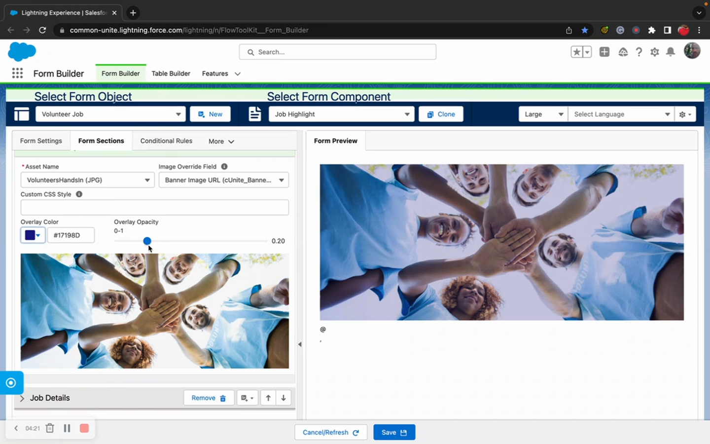
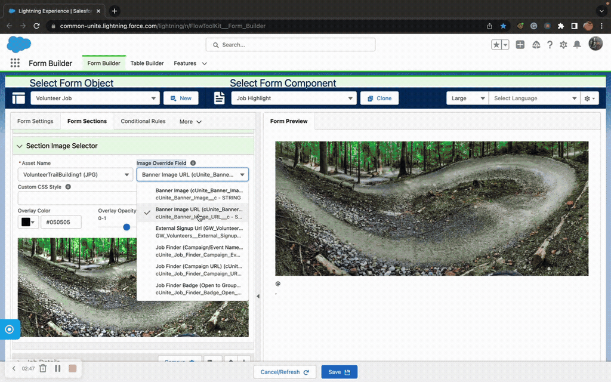

# Image

> Display images from Content Assets, external URLs, or SVGs on Flow Screens with optional overlays and rich text.

## Overview

Form (Image) displays an image on a Flow Screen from a Salesforce Content Asset, a custom URL, or an SVG source. It supports color overlays, opacity control, custom styling, and an optional rich text layer on top of the image.

Use it for branding, instructional graphics, splash screens, or any scenario where you need to display visual content within a Flow.

## Where to Use It

- **Flow Screen**

## Video Walkthrough



## Properties

### Inputs

| Property | Type | Required | Default | Description |
|---|---|---|---|---|
| `contentAssetName` | String | No | — | DeveloperName of a Salesforce Content Asset |
| `customImageLink` | String | No | — | External URL or relative path to an image |
| `isSvg` | Boolean | No | — | Set to true when the content asset is an SVG |
| `overlayHexColor` | String | No | — | Hex color for an overlay on top of the image |
| `overlayOpacity` | Integer | No | — | Opacity of the overlay (0-100) |
| `imageStyle` | String | No | — | Custom CSS styles applied to the image element |
| `customRichText` | String | No | — | Rich text HTML rendered on top of the image |
| `serverURL` | String | No | — | Salesforce server URL (for Experience Cloud path resolution) |
| `topMargin` | String | No | — | Top margin SLDS class |
| `bottomMargin` | String | No | — | Bottom margin SLDS class |

## Common Patterns

### 1. Branded Splash Screen
Upload your logo as a Content Asset. Display it on the first Flow screen with a rich text welcome message overlaid.

### 2. Instructional Graphic
Use `customImageLink` to display a diagram or screenshot that guides users through the current form step.

### 3. Styled Hero Banner
Combine an image with `overlayHexColor` and `overlayOpacity` to create a darkened background, then use `customRichText` for white text on top.

## Tips & Considerations

- **Content Asset vs URL**: Content Assets are packaged and deployed with your metadata. External URLs require network access and may be blocked by CSP settings in Experience Cloud.
- **SVG Support**: Set `isSvg=true` for Content Assets that are SVG files — the component handles SVG rendering differently than raster images.
- **Experience Cloud**: Set `serverURL` to resolve Content Asset paths correctly in Experience Cloud contexts.
