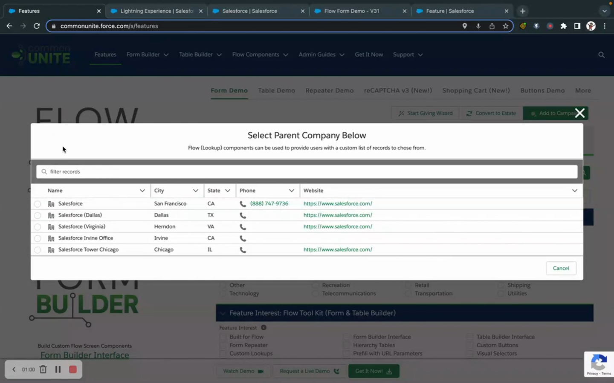

# Lookup
> A configurable lookup field component that adds custom search, filtering, and record creation to lookup fields on Flow Screens.

## Overview

Form (Lookup) enhances the standard lookup experience on Flow Screens by pairing with Flow Form to provide a fully customizable lookup table. When a user clicks a lookup field in a Flow Form, this component controls what records appear, how they're filtered, and whether users can create new records inline.

The Lookup component uses the same Form metadata as Flow Form and Data Table for its search results table, giving you consistent column definitions, filtering, and display across all components. It supports custom filters, hierarchy trees, row numbers, and new record creation — all within the lookup modal.

## Where to Use It

- **Flow Screen** (used alongside Flow Form or independently)

## Video Walkthrough



## Quick Start

1. **Create a Form** — In Form Builder, create a Form for the lookup's target object (e.g., Account for an Account lookup field) with the fields you want displayed in the lookup table.
2. **Add Lookup to a Screen** — In Flow Builder, drag "Form (Lookup)" onto the same screen as your Flow Form.
3. **Configure** — Select the target object and form. Optionally specify a `fieldName` to limit which lookup field this component configures.
4. **Run** — When a user clicks a lookup field, the lookup table appears with your configured columns, search, and filters.

## Properties

### Inputs

| Property | Type | Required | Default | Description |
|---|---|---|---|---|
| `object` | String | Yes | — | SObject API name for the lookup target (e.g., "Account") |
| `formQualifiedApiName` | String | Yes | — | QualifiedApiName of the Form metadata for the lookup table columns |
| `fieldName` | String | No | — | Specific lookup field API name to configure. If blank, applies to all lookup fields for the target object |
| `recordTemplate` | SObject (Generic T) | No | — | Template record with default values for new records created via the lookup |
| `overrideTableFormName` | String | No | — | Alternative Form QualifiedApiName to use for the edit form when creating new records |
| `dynamicFormSelectorEnabled` | Boolean | No | false | Allow dynamic form selection via a variable |
| `recordTypeOptions` | RecordType[] | No | — | Available record types for new record creation |
| `displayAsDataTree` | Boolean | No | false | Display lookup results as a hierarchy tree |
| `hierarchyFieldName` | String | No | — | Parent lookup field for tree display (e.g., "ParentId") |
| `showRowNumberColumn` | Boolean | No | — | Show row numbers in the lookup table |
| `hideTableHeader` | Boolean | No | — | Hide column headers in the lookup table |
| `hideTableFooter` | Boolean | No | — | Hide the table footer |
| `tableRowClass` | String | No | — | Custom CSS class for table rows |
| `tableHeight` | Integer | No | — | Fixed height in pixels for the lookup table |
| `allowNew` | Boolean | No | — | Show the "New" button to create records from the lookup |
| `newButtonLabel` | String | No | — | Custom label for the New button |
| `newRecordModalHeading` | String | No | — | Heading for the new record modal |
| `newRecordModalSubheading` | String | No | — | Subheading for the new record modal |
| `enableFilter` | String | No | — | Enable search/filter functionality |
| `minSearchString` | Integer | No | — | Minimum characters before search begins |
| `serverURL` | String | No | — | Salesforce server URL (needed for Experience Cloud) |

### Outputs

| Property | Type | Description |
|---|---|---|
| `prefillRecords` | SObject[] (Generic T) | Deprecated — do not use |
| `newRecords` | SObject[] (Generic T) | Records created via the "New" button in the lookup |
| `searchValue` | String | Current search/filter text entered by the user |

## How It Works

**Message Channel Communication**: The Lookup component communicates with Flow Form via Lightning Message Channels (FlowForm and FlowFormLookupSearch). When a user clicks a lookup field in Flow Form, a message is published that opens the lookup table. When the user selects a record, a message is sent back to populate the lookup field.

**Search Behavior**: The lookup table supports client-side filtering across all visible columns. When `enableFilter` is set, a search bar appears above the table. The `minSearchString` property controls how many characters must be typed before filtering begins.

**New Record Creation**: When `allowNew` is enabled, users can create records directly from the lookup modal. The new record form uses the same Form metadata (or the `overrideTableFormName` form if specified). New records appear in the `newRecords` output collection — your Flow must insert them.

## Works With

| Component | Integration |
|---|---|
| **Flow Form** | Provides the lookup table for lookup fields rendered by Flow Form |
| **Data Table** | Provides lookup tables for lookup columns in the data table |
| **Custom Buttons** | New record creation in the lookup respects button configurations |
| **Message Channels** | Uses FlowFormLookupSearch and FlowFormImport channels for communication |

## Common Patterns

### 1. Account Lookup with Custom Columns
Create a Form for Account with Name, Industry, Phone, and BillingCity. Add the Lookup component for Account lookups. Users see a rich table instead of the default lookup search.

### 2. Hierarchical Lookup
For Account lookups, set `displayAsDataTree=true` and `hierarchyFieldName=ParentId`. Users can expand parent-child relationships to find the right account.

### 3. Lookup with Inline Create
Enable `allowNew=true` and provide a `recordTemplate` with default values. Users who can't find a record can create one without leaving the flow.

## Tips & Considerations

- **Field Targeting**: If your screen has multiple lookup fields to the same object, use `fieldName` to associate different Lookup components with specific fields.
- **Performance**: The lookup table loads records on demand. For objects with very large record counts, ensure your Form has fields that help users filter effectively.
- **New Records Need DML**: Records created in the lookup modal are returned in the `newRecords` output but are NOT automatically saved. Add a Create Records element in your Flow to insert them.
- **Experience Cloud**: Set `serverURL` to `{!$Flow.ServerURL}` when the flow runs in Experience Cloud.
- **One Per Object**: You typically need one Lookup component per target object on your screen. If your form has lookup fields to Account and Contact, add two Lookup components.
