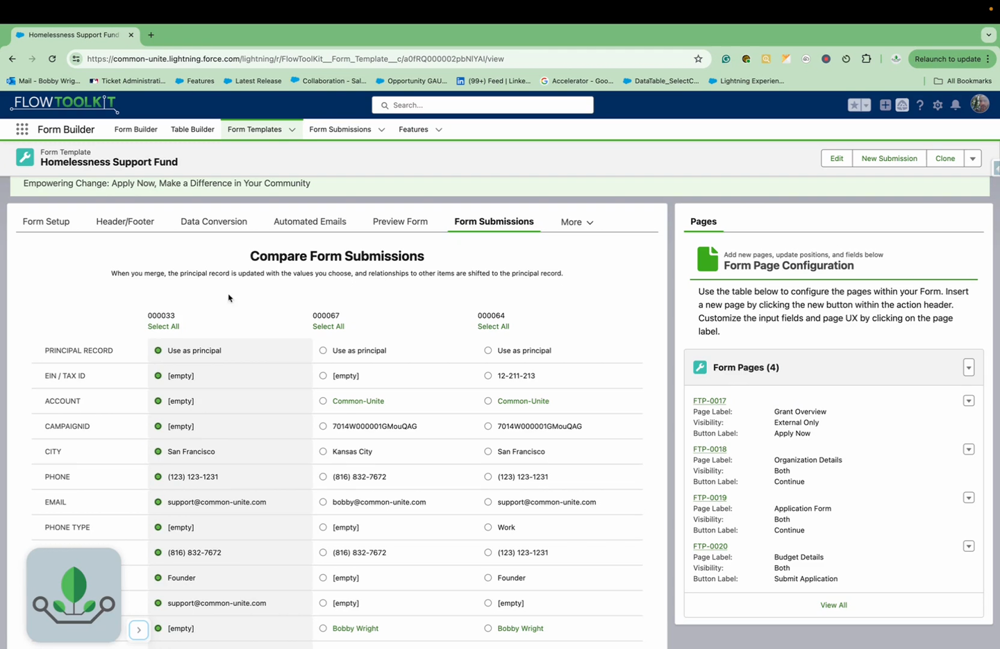

# Merge Records

> A visual side-by-side record comparison component for identifying and merging duplicate records on Flow Screens.

## Overview

Form (Merge Records) displays multiple records side by side, letting users compare field values and select a primary record. The component highlights differences between records and lets users pick which values to keep, producing a merged result record.

This component is designed for duplicate management workflows: find potential duplicates (using the Check for Duplicates invocable action or a SOQL query), present them for comparison, and use the merged output to update the primary record and delete alternates.

## Where to Use It

- **Flow Screen**

## Video Walkthrough



## Properties

### Inputs

| Property | Type | Required | Default | Description |
|---|---|---|---|---|
| `records` | SObject[] (Generic T) | No | — | Collection of records to compare |
| `record` | SObject (Generic T) | No | — | Record with custom/override values to include in comparison |
| `object` | String | No | — | SObject API name |
| `elementApiName` | String | No | — | Screen element API name (used for component key) |
| `topMargin` | String | No | — | Top margin SLDS class |
| `bottomMargin` | String | No | — | Bottom margin SLDS class |

### Outputs

| Property | Type | Description |
|---|---|---|
| `result` | SObject (Generic T) | The primary record with only the changed/synced field values |
| `primaryRecord` | SObject (Generic T) | The primary record with ALL field values (changed + unchanged) |
| `alternateRecords` | SObject[] (Generic T) | All records not selected as primary |
| `totalAlternateRecords` | Integer | Count of alternate records |

## Common Patterns

### 1. Duplicate Merge Workflow
Use the "Check for Duplicates" invocable action to find matches. Pass the duplicates to Merge Records. After the screen, use the "Merge Records" invocable action with `primaryRecord` as the target and `alternateRecords` as the duplicates to merge.

### 2. Manual Record Comparison
Query records that might be duplicates (e.g., Contacts with similar names). Display them for manual comparison. Use the `result` output to update the primary record with the user's chosen values.

## Tips & Considerations

- **Supported Objects**: The Merge Records invocable action (used after comparison) supports Account, Contact, Case, and Lead. The comparison component itself works with any object.
- **Result vs Primary**: `result` contains only the fields the user changed (for partial updates). `primaryRecord` contains all fields (for full record replacement).
- **Pre-filtering**: Always pre-filter records before displaying. Comparing more than 5 records at once becomes difficult for users.
